# PRM Tool — Server + Console Client

## Project & Resource Management Tool
A console-based client-server application for IT service companies to manage employees, projects, allocations, timesheets, and AI-powered resource matching.

**Tech Stack:** Node.js · TypeScript · Express · MySQL · node-cron · JWT · bcryptjs

---

## Table of Contents
1. [Folder Structure](#1-folder-structure)
2. [Data Flow — How a Request Travels](#2-data-flow--how-a-request-travels)
3. [Database Layer](#3-database-layer)
4. [Models / Interfaces](#4-models--interfaces)
5. [Repository Layer](#5-repository-layer)
6. [Service Layer](#6-service-layer)
7. [Controller Layer](#7-controller-layer)
8. [Middleware](#8-middleware)
9. [Routes](#9-routes)
10. [Scheduler](#10-scheduler)
11. [AI Integration](#11-ai-integration)
12. [SOLID Principles — Where & How](#12-solid-principles--where--how)
13. [Design Patterns Used](#13-design-patterns-used)
14. [Design Principles Applied](#14-design-principles-applied)
15. [API Reference](#15-api-reference)
16. [ER Diagram](#16-er-diagram)
17. [Sequence Diagrams](#17-sequence-diagrams)
18. [Flow Diagram](#18-flow-diagram)
19. [Use-Case Diagram](#19-use-case-diagram)
20. [UML Diagrams](#20-uml-diagrams)
21. [Postman Testing Guide](#21-postman-testing-guide)
28. [Console Client — End-to-End Testing Guide](#28-console-client--end-to-end-testing-guide)

---

## 1. Folder Structure

```
server/
├── src/
│   ├── config/
│   │   └── env.ts                        # Loads and exports all environment variables
│   │
│   ├── database/
│   │   ├── connection.ts                 # Singleton MySQL connection pool
│   │   ├── migrations/
│   │   │   └── 001_schema.sql            # Full DB schema — run once to create all tables
│   │   └── seeds/
│   │       ├── 001_admin_seed.sql        # Reference SQL (not used directly)
│   │       └── seed.ts                   # Node script — creates first admin with hashed password
│   │
│   ├── models/
│   │   └── interfaces/
│   │       ├── User.ts                   # User type, UserRole, CreateUserDTO, UpdatePasswordDTO
│   │       ├── Employee.ts               # Employee, Skill, EmployeeSkill, proficiency types, DTOs
│   │       ├── Project.ts                # Project, Milestone, health/status enums, DTOs
│   │       ├── Allocation.ts             # Allocation, AllocationWithDetails, CreateAllocationDTO
│   │       ├── Timesheet.ts              # Timesheet, TimesheetEntry, SubmitTimesheetDTO
│   │       └── SystemConfig.ts           # SystemConfigMap, LLMProvider, UpdateConfigDTO
│   │
│   ├── repositories/
│   │   ├── interfaces/
│   │   │   ├── IBaseRepository.ts        # Generic contract: findById, findAll, delete
│   │   │   ├── IUserRepository.ts        # User-specific DB operations contract
│   │   │   ├── IEmployeeRepository.ts    # Employee + skills DB operations contract
│   │   │   ├── IProjectRepository.ts     # Project + milestones DB operations contract
│   │   │   ├── IAllocationRepository.ts  # Allocation DB operations contract
│   │   │   ├── ITimesheetRepository.ts   # Timesheet DB operations contract
│   │   │   └── ISystemConfigRepository.ts# System config DB operations contract
│   │   │
│   │   └── implementations/
│   │       ├── UserRepository.ts         # MySQL implementation of IUserRepository
│   │       ├── EmployeeRepository.ts     # MySQL implementation of IEmployeeRepository
│   │       ├── ProjectRepository.ts      # MySQL implementation of IProjectRepository
│   │       ├── AllocationRepository.ts   # MySQL implementation of IAllocationRepository
│   │       ├── TimesheetRepository.ts    # MySQL implementation of ITimesheetRepository
│   │       └── SystemConfigRepository.ts # MySQL implementation of ISystemConfigRepository
│   │
│   ├── services/
│   │   ├── auth.service.ts               # Login, password change, JWT generation
│   │   ├── user.service.ts               # Create/manage user accounts (Admin only)
│   │   ├── employee.service.ts           # Employee profile, skills, manager assignment
│   │   ├── project.service.ts            # Project CRUD, milestone management
│   │   ├── allocation.service.ts         # Allocate/end, over-allocation prevention
│   │   ├── timesheet.service.ts          # Submit timesheets, validate hours
│   │   ├── config.service.ts             # Read/write system configuration
│   │   └── ai.service.ts                 # Skill matcher + risk summary (calls LLM)
│   │
│   ├── controllers/
│   │   ├── auth.controller.ts            # POST /auth/login, POST /auth/change-password
│   │   ├── user.controller.ts            # Admin user management endpoints
│   │   ├── employee.controller.ts        # Admin employee management endpoints
│   │   ├── project.controller.ts         # Admin project + milestone endpoints
│   │   ├── allocation.controller.ts      # Manager allocation endpoints
│   │   ├── timesheet.controller.ts       # Employee timesheet endpoints
│   │   ├── dashboard.controller.ts       # Manager resource dashboard
│   │   ├── config.controller.ts          # Admin system config endpoints
│   │   └── ai.controller.ts              # AI skill match + risk summary endpoints
│   │
│   ├── routes/
│   │   ├── auth.routes.ts                # /api/auth/*
│   │   ├── admin.routes.ts               # /api/admin/* (role-guarded: ADMIN only)
│   │   ├── manager.routes.ts             # /api/manager/* (role-guarded: MANAGER only)
│   │   └── employee.routes.ts            # /api/employee/* (role-guarded: EMPLOYEE only)
│   │
│   ├── middleware/
│   │   ├── auth.ts                       # Verifies JWT, attaches user to req
│   │   ├── rbac.ts                       # Role-based access control — blocks wrong roles
│   │   ├── validation.ts                 # Request body validation (Fail Fast)
│   │   └── errorHandler.ts              # Global error handler (last middleware)
│   │
│   ├── scheduler/
│   │   └── scheduler.ts                  # node-cron jobs: recompute utilisation + health flags
│   │
│   ├── ai/
│   │   ├── interfaces/
│   │   │   └── ILLMProvider.ts           # Adapter interface: skillMatch(), riskSummary()
│   │   ├── providers/
│   │   │   ├── gemini.provider.ts        # Google Gemini implementation
│   │   │   └── groq.provider.ts          # Groq implementation
│   │   └── llm.factory.ts               # Factory: returns correct provider from config
│   │
│   ├── utils/
│   │   └── response.ts                   # sendSuccess() and sendError() helpers
│   │
│   ├── app.ts                            # Express app setup: middleware + routes wired
│   └── server.ts                         # Entry point: DB ping + app.listen()
│
├── .env                                  # Environment variables (never commit this)
├── .gitignore
├── package.json
└── tsconfig.json
```

---

## 2. Data Flow — How a Request Travels

Every API call follows the same path through the application layers:

```
HTTP Request (Postman / Console Client)
        │
        ▼
[Route] — defines the URL and which middleware + controller handles it
        │
        ▼
[Middleware: auth.ts] — checks JWT token, rejects if missing/invalid
        │
        ▼
[Middleware: rbac.ts] — checks role (ADMIN / MANAGER / EMPLOYEE), rejects if wrong
        │
        ▼
[Middleware: validation.ts] — checks required fields, rejects early if missing (Fail Fast)
        │
        ▼
[Controller] — extracts data from req.body / req.params, calls service, sends response
        │
        ▼
[Service] — contains ALL business logic (rules, validations, orchestration)
        │
        ▼
[Repository] — executes SQL queries, returns typed objects
        │
        ▼
[MySQL Database]
        │
        ▼
[Repository] — returns result to service
        │
        ▼
[Service] — processes result, applies business rules
        │
        ▼
[Controller] — calls sendSuccess() or sendError()
        │
        ▼
HTTP Response (JSON)
```

**Why this layering?**
Each layer has ONE job. If you need to swap MySQL for PostgreSQL, you only change Repositories. If business rules change, you only touch Services. Controllers never touch SQL. This is Separation of Concerns + Single Responsibility.

---

## 3. Database Layer

### `src/database/connection.ts`

**What it does:** Creates and exports a single MySQL connection pool shared across the entire app.

**Why a pool?** Opening a new connection per request is expensive. A pool maintains N open connections (default: 10) and lends them out as needed.

**Pattern: Singleton**
```typescript
class Database {
  private static instance: mysql.Pool | null = null;
  static getInstance(): mysql.Pool {
    if (!Database.instance) {
      Database.instance = mysql.createPool({ ... });
    }
    return Database.instance;
  }
}
export const pool = Database.getInstance();
```
`getInstance()` ensures only one pool is ever created. Every repository gets the same pool object — no duplicate connections.

---

### `src/database/migrations/001_schema.sql`

Run once to create all 10 tables:

| Table | Purpose |
|---|---|
| `users` | Login credentials, role, active flag, force_password_change flag |
| `employees` | Profile data — department, status (BENCH/ALLOCATED), manager link |
| `skills` | Master list of skills with category |
| `employee_skills` | Junction: which employee has which skill at what proficiency |
| `projects` | Project details, status, health status, story points |
| `milestones` | Sub-deliverables per project with due dates and story points |
| `allocations` | Who is assigned to which project, at what %, for which dates |
| `timesheets` | One row per employee per week — total hours + SUBMITTED/MISSED |
| `timesheet_entries` | Individual project entries within a timesheet week |
| `system_config` | Key-value store for LLM key, provider, scheduler interval, max hours |

---

### `src/database/seeds/seed.ts`

**What it does:** Creates the first Admin account with username `admin`, password `Admin@1234` (bcrypt hashed).

**Why a script and not a SQL file?** We need bcrypt to hash the password. SQL cannot call bcrypt — only application code can. So we run this as a Node.js script once at setup.

**Run it with:**
```bash
npx ts-node src/database/seeds/seed.ts
```

---

## 4. Models / Interfaces

All files live in `src/models/interfaces/`. These are **pure TypeScript types** — no logic, no SQL, no class methods. They define the shape of data moving through the app.

**Why interfaces and not classes?**
- DTOs (Data Transfer Objects) only carry data — they need no behaviour
- Interfaces are erased at compile time — zero runtime overhead
- Easy to extend without breaking callers (Open/Closed Principle)

### Key types per file

**`User.ts`**
- `User` — mirrors the `users` table row
- `UserRole` — `'ADMIN' | 'MANAGER' | 'EMPLOYEE'`
- `CreateUserDTO` — what Admin sends when creating a user
- `UpdatePasswordDTO` — payload for password change

**`Employee.ts`**
- `Employee` — mirrors `employees` table
- `EmployeeWithDetails` — employee + username/email + skills array (for dashboard views)
- `EmployeeSkillDetail` — flattened join of employee_skills + skills
- `AddSkillDTO / UpdateSkillDTO` — payloads for skill management

**`Project.ts`**
- `ProjectStatus` — `'PLANNED' | 'ACTIVE' | 'ON_HOLD' | 'COMPLETED'`
- `HealthStatus` — `'ON_TRACK' | 'ATTENTION' | 'AT_RISK'`
- `MilestoneStatus` — `'NOT_STARTED' | 'IN_PROGRESS' | 'DONE'`
- `ProjectWithDetails` — project + manager name + done story points (for list view)

**`Allocation.ts`**
- `Allocation` — mirrors `allocations` table
- `AllocationWithDetails` — includes employee_name and project_name

**`Timesheet.ts`**
- `Timesheet` — one row per employee-week
- `TimesheetEntry` — one row per project within that week
- `SubmitTimesheetDTO` — what employee sends: week date + array of project/hours/tags

**`SystemConfig.ts`**
- `SystemConfigMap` — typed version of the key-value config table
- `LLMProvider` — `'gemini' | 'groq'`

---

## 5. Repository Layer

### Why Repositories?

Without repositories, every service would write raw SQL directly. That causes:
- Duplication — same query written in 5 places
- No testability — can't swap database without rewriting everything
- Broken Single Responsibility — service does both business logic AND database access

Repositories solve this by putting **all SQL in one place per entity**.

### `IBaseRepository<T>` (`src/repositories/interfaces/IBaseRepository.ts`)

```typescript
export interface IBaseRepository<T> {
  findById(id: number): Promise<T | null>;
  findAll(): Promise<T[]>;
  delete(id: number): Promise<void>;
}
```

Every repository extends this. This is the **Liskov Substitution Principle** — any concrete repository can be used wherever `IBaseRepository` is expected.

### Individual Repository Interfaces

Each extends `IBaseRepository<T>` and adds entity-specific methods:

| Interface | Extra methods beyond base |
|---|---|
| `IUserRepository` | findByUsername, findByEmail, create, updatePassword, setForcePasswordChange, setActive |
| `IEmployeeRepository` | findByUserId, findAllWithDetails, findByManagerId, create, update, setActive, updateStatus, assignManager, getSkills, addSkill, updateSkill, removeSkill, findOrCreateSkill |
| `IProjectRepository` | findAllWithDetails, findByManagerId, create, update, updateHealthStatus, getMilestones, addMilestone, updateMilestone, findMilestoneById |
| `IAllocationRepository` | findAllWithDetails, findByEmployeeId, findByProjectId, findActiveByEmployeeId, create, endAllocation, endAllActiveForEmployee, getTotalUtilisationInPeriod |
| `ITimesheetRepository` | findByEmployeeId, findByEmployeeAndWeek, findWithEntries, findTeamTimesheets, submit, markMissed |
| `ISystemConfigRepository` | getAll, update |

### Concrete Implementations (`src/repositories/implementations/`)

Each class implements its interface using `mysql2/promise`. Key methods to know:

**`UserRepository.create()`**
- Hashes the password with `bcrypt.hash(password, 10)` before storing
- The salt rounds of 10 means 2^10 = 1024 hashing iterations — secure against brute force

**`AllocationRepository.getTotalUtilisationInPeriod()`**
- Called before every new allocation to check if adding the new % would exceed 100%
- Uses date-range overlap detection: `from_date <= requested_to AND to_date >= requested_from`

**`TimesheetRepository.submit()`**
- Uses a **database transaction** — either all entries are saved or none are
- This prevents partial timesheet saves if something fails mid-way

**`EmployeeRepository.findOrCreateSkill()`**
- Checks if a skill with that name already exists
- Only creates a new skill row if it doesn't — prevents duplicate skill entries

---

## 6. Service Layer

*(Populated as each service is built)*

Services contain **all business rules**. They:
- Call one or more repositories
- Enforce rules (e.g., cannot exceed 100% allocation)
- Never touch `req` or `res` — completely independent of HTTP

---

## 7. Controller Layer

*(Populated as each controller is built)*

Controllers are **thin**. They only:
1. Read from `req.body`, `req.params`, `req.query`
2. Call one service method
3. Call `sendSuccess()` or `sendError()`

No business logic lives here. No SQL. No bcrypt.

---

## 8. Middleware

### `auth.ts` — JWT Verification
Runs on every protected route. Reads the `Authorization: Bearer <token>` header, verifies the token using `JWT_SECRET`, and attaches the decoded user to `req.user`. If the token is missing or invalid, returns 401 immediately.

### `rbac.ts` — Role-Based Access Control
After auth middleware confirms identity, rbac checks the role. Example: `requireRole('ADMIN')` blocks Managers and Employees from Admin routes. Returns 403 if wrong role.

### `validation.ts` — Request Validation (Fail Fast)
Checks that required fields are present and valid before the request reaches the service. If validation fails, returns 400 immediately — we never waste time running business logic on bad input.

**Why Fail Fast?** Catching bad data at the boundary (HTTP layer) is cheaper than discovering it deep inside service or database code.

### `errorHandler.ts` — Global Error Handler
The last middleware registered in `app.ts`. Catches any unhandled error thrown anywhere in the app and returns a clean 500 response. Prevents raw stack traces leaking to the client.

---

## 9. Routes

| File | Prefix | Guard |
|---|---|---|
| `auth.routes.ts` | `/api/auth` | None (public) |
| `admin.routes.ts` | `/api/admin` | JWT + ADMIN role |
| `manager.routes.ts` | `/api/manager` | JWT + MANAGER role |
| `employee.routes.ts` | `/api/employee` | JWT + EMPLOYEE role |

---

## 10. Scheduler

*(Populated when scheduler is built)*

`node-cron` runs two background jobs on a configurable interval (default: every 4 hours):

1. **Utilisation recompute** — checks each employee's active allocations and sets status to `BENCH` or `ALLOCATED`
2. **Health flagging** — checks each active project's milestones and timesheet hours, sets `health_status` to `ON_TRACK`, `ATTENTION`, or `AT_RISK`

---

## 11. AI Integration

*(Populated when AI layer is built)*

Uses the **Adapter Pattern**. Both Gemini and Groq implement `ILLMProvider`:

```typescript
interface ILLMProvider {
  skillMatch(context: string): Promise<string>;
  riskSummary(context: string): Promise<string>;
}
```

`LLMFactory.create(provider)` returns the correct implementation. Switching providers only requires changing the config — no code changes in services.

---

## 12. SOLID Principles — Where & How

### S — Single Responsibility Principle
> A class should have only one reason to change.

- `UserRepository` — only handles user DB operations. If the DB query changes, only this file changes.
- `AuthService` — only handles login and password logic. If JWT logic changes, only this file changes.
- `ErrorHandler middleware` — only handles sending error responses. One job, one file.

### O — Open/Closed Principle
> Open for extension, closed for modification.

- `ILLMProvider` interface — adding a new LLM provider (e.g., OpenAI) means creating a new class that implements `ILLMProvider`. No existing code is modified.
- Project health strategies — new health logic can be added as a new strategy without touching existing ones.

### L — Liskov Substitution Principle
> Subtypes must be substitutable for their base types.

- All repositories implement `IBaseRepository<T>`. Any code that depends on `IBaseRepository<User>` works with `UserRepository` without knowing the concrete type.
- `GeminiProvider` and `GroqProvider` both implement `ILLMProvider` — either can be used wherever `ILLMProvider` is expected.

### I — Interface Segregation Principle
> Clients should not be forced to depend on interfaces they don't use.

- `ISystemConfigRepository` only has `getAll()` and `update()` — it does not inherit the `delete()` from `IBaseRepository` because config rows are never deleted.
- Each repository interface is specific to its entity. No single fat interface for all DB operations.

### D — Dependency Inversion Principle
> High-level modules should not depend on low-level modules. Both should depend on abstractions.

- Services receive repository **interfaces** (not concrete classes) via constructor injection.
- Example: `AuthService` depends on `IUserRepository`, not `UserRepository`. If you swap the DB implementation, `AuthService` doesn't change.

```typescript
class AuthService {
  constructor(private userRepo: IUserRepository) {}
  // userRepo could be UserRepository, a mock, or any future implementation
}
```

---

## 13. Design Patterns Used

### Repository Pattern
**Where:** `src/repositories/`
**Why:** Isolates all database access. Services never write SQL. If MySQL is replaced with PostgreSQL tomorrow, only the implementation files change — interfaces and services stay the same.

### Singleton Pattern
**Where:** `src/database/connection.ts`
**Why:** The DB connection pool must be created exactly once. Multiple pools would exhaust MySQL connections. The `Database.getInstance()` method ensures only one pool exists across the entire app lifecycle.

### Adapter Pattern
**Where:** `src/ai/interfaces/ILLMProvider.ts` + `src/ai/providers/`
**Why:** Gemini and Groq have different APIs and SDKs. The Adapter wraps each behind a common interface so the rest of the app doesn't care which one is active. Switching is one config change.

### Factory Pattern
**Where:** `src/ai/llm.factory.ts`
**Why:** `LLMFactory.create(provider)` decides which concrete provider to instantiate based on the system config. The caller never uses `new GeminiProvider()` directly — the factory encapsulates that decision.

### Strategy Pattern
**Where:** `src/scheduler/` (project health scoring)
**Why:** Health scoring rules (what makes a project AT_RISK vs ATTENTION) can change. Wrapping each rule set as a strategy means rules can be swapped or extended without modifying the scheduler core.

---

## 14. Design Principles Applied

### Separation of Concerns
Each layer knows nothing about the layer above it:
- Repositories do not know about HTTP or business rules
- Services do not know about HTTP or SQL
- Controllers do not know about SQL or business rules
This means each layer can be tested, changed, and reasoned about in isolation.

### DRY — Don't Repeat Yourself
- `sendSuccess()` and `sendError()` in `utils/response.ts` — one definition, used in every controller
- `IBaseRepository<T>` — `findById`, `findAll`, `delete` defined once, inherited by all repositories
- `dotenv.config()` called once in `config/env.ts`, imported everywhere else

### Fail Fast
- Validation middleware rejects bad requests at the HTTP boundary before any service or DB code runs
- `server.ts` pings the DB on startup and exits immediately if the connection fails — no silent broken state

### Law of Demeter (Principle of Least Knowledge)
- Controllers only call their own service — they do not reach into the service's repository
- Services only call their own repository — they do not directly use another service's repository

---

## 15. API Reference

*(Populated as each route group is completed)*

### Auth
| Method | URL | Auth | Body | Description |
|---|---|---|---|---|
| POST | `/api/auth/login` | None | `{ username, password }` | Login, returns JWT |
| POST | `/api/auth/change-password` | JWT | `{ currentPassword, newPassword }` | Change password |

### Auth
| Method | URL | Auth | Body | Description |
|---|---|---|---|---|
| POST | `/api/auth/login` | None | `{ username, password }` | Login, returns JWT |
| POST | `/api/auth/change-password` | Bearer JWT | `{ currentPassword, newPassword }` | Change own password |
| POST | `/api/auth/force-change-password` | Bearer JWT | `{ newPassword }` | First-login forced change |

### Admin — Users
| Method | URL | Auth | Body | Description |
|---|---|---|---|---|
| POST | `/api/admin/users` | Bearer JWT (ADMIN) | `{ username, email, password, role }` | Create user account |
| GET | `/api/admin/users` | Bearer JWT (ADMIN) | — | List all users |
| PUT | `/api/admin/users/:id/reset-password` | Bearer JWT (ADMIN) | `{ newPassword }` | Reset user password |
| PUT | `/api/admin/users/:id/deactivate` | Bearer JWT (ADMIN) | — | Deactivate user |
| PUT | `/api/admin/users/:id/reactivate` | Bearer JWT (ADMIN) | — | Reactivate user |

### Admin — Employees
| Method | URL | Auth | Body | Description |
|---|---|---|---|---|
| GET | `/api/admin/employees` | Bearer JWT (ADMIN) | — | List all employees |
| GET | `/api/admin/employees/:id` | Bearer JWT (ADMIN) | — | Get employee detail |
| PUT | `/api/admin/employees/:id` | Bearer JWT (ADMIN) | `{ full_name?, department? }` | Update employee |
| PUT | `/api/admin/employees/:id/deactivate` | Bearer JWT (ADMIN) | — | Deactivate employee |
| GET | `/api/admin/employees/:id/skills` | Bearer JWT (ADMIN) | — | List employee skills |
| POST | `/api/admin/employees/:id/skills` | Bearer JWT (ADMIN) | `{ skill_name, category, proficiency }` | Add skill |
| PUT | `/api/admin/employees/:id/skills/:skillId` | Bearer JWT (ADMIN) | `{ proficiency }` | Update proficiency |
| DELETE | `/api/admin/employees/:id/skills/:skillId` | Bearer JWT (ADMIN) | — | Remove skill |
| PUT | `/api/admin/employees/assign-manager` | Bearer JWT (ADMIN) | `{ employee_user_id, manager_user_id }` | Assign manager |

### Admin — Projects
| Method | URL | Auth | Body | Description |
|---|---|---|---|---|
| POST | `/api/admin/projects` | Bearer JWT (ADMIN) | `{ name, start_date, end_date, status, total_story_points, manager_id? }` | Create project |
| GET | `/api/admin/projects` | Bearer JWT (ADMIN) | — | List all projects |
| GET | `/api/admin/projects/:id` | Bearer JWT (ADMIN) | — | Get project detail |
| PUT | `/api/admin/projects/:id` | Bearer JWT (ADMIN) | any project fields | Update project |
| GET | `/api/admin/projects/:id/milestones` | Bearer JWT (ADMIN) | — | List milestones |
| POST | `/api/admin/projects/:id/milestones` | Bearer JWT (ADMIN) | `{ title, due_date, story_points }` | Add milestone |
| PUT | `/api/admin/projects/:id/milestones/:milestoneId` | Bearer JWT (ADMIN) | `{ status }` | Update milestone status |

### Admin — Allocations & Config
| Method | URL | Auth | Body | Description |
|---|---|---|---|---|
| GET | `/api/admin/allocations` | Bearer JWT (ADMIN) | — | View all allocations |
| GET | `/api/admin/config` | Bearer JWT (ADMIN) | — | View system config |
| PUT | `/api/admin/config` | Bearer JWT (ADMIN) | `{ llm_provider?, llm_api_key?, scheduler_interval?, max_weekly_hours? }` | Update config |

### Manager
| Method | URL | Auth | Body | Description |
|---|---|---|---|---|
| GET | `/api/manager/dashboard` | Bearer JWT (MANAGER) | — | Resource dashboard (bench + allocated) |
| GET | `/api/manager/dashboard/employees/:id` | Bearer JWT (MANAGER) | — | Employee drill-down |
| POST | `/api/manager/allocations` | Bearer JWT (MANAGER) | `{ employee_id, project_id, utilisation_pct, from_date, to_date }` | Allocate resource |
| PUT | `/api/manager/allocations/:id/end` | Bearer JWT (MANAGER) | — | End allocation |
| GET | `/api/manager/projects/:id/allocations` | Bearer JWT (MANAGER) | — | Project allocations |
| GET | `/api/manager/projects` | Bearer JWT (MANAGER) | — | My projects |
| GET | `/api/manager/projects/:id` | Bearer JWT (MANAGER) | — | Project detail |
| GET | `/api/manager/timesheets?week=YYYY-MM-DD` | Bearer JWT (MANAGER) | — | Team timesheets |
| POST | `/api/manager/ai/skill-match` | Bearer JWT (MANAGER) | `{ requirement, project_id }` | AI skill match |
| POST | `/api/manager/ai/risk-summary` | Bearer JWT (MANAGER) | `{ project_id }` | AI risk summary |

### Employee
| Method | URL | Auth | Body | Description |
|---|---|---|---|---|
| POST | `/api/employee/timesheets` | Bearer JWT (EMPLOYEE) | `{ week_start_date, entries: [{ project_id, hours_worked, activity_tags }] }` | Submit timesheet |
| GET | `/api/employee/timesheets` | Bearer JWT (EMPLOYEE) | — | My timesheets + missed reminder |
| GET | `/api/employee/timesheets/:id` | Bearer JWT (EMPLOYEE) | — | Timesheet detail |
| GET | `/api/employee/allocations` | Bearer JWT (EMPLOYEE) | — | My allocations |

---

## 16. ER Diagram

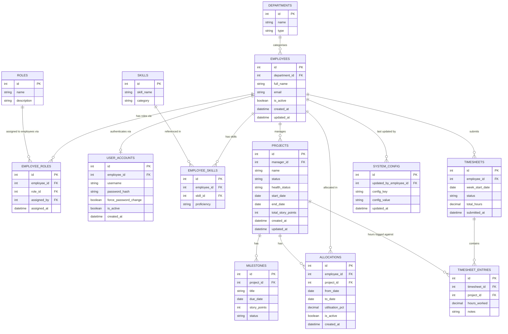

---

## 17. Sequence Diagrams

### Login Flow

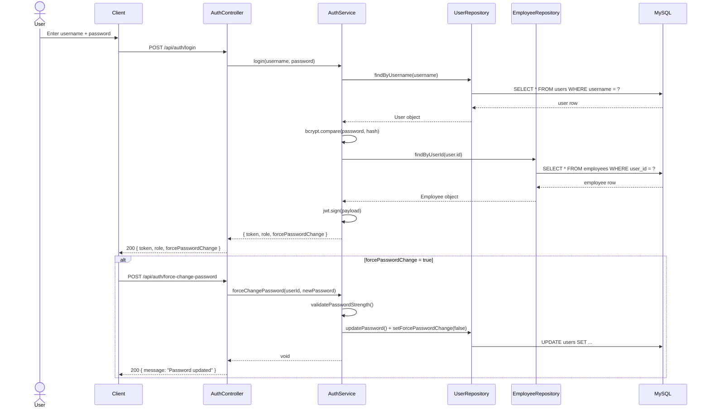

### Allocate Resource Flow

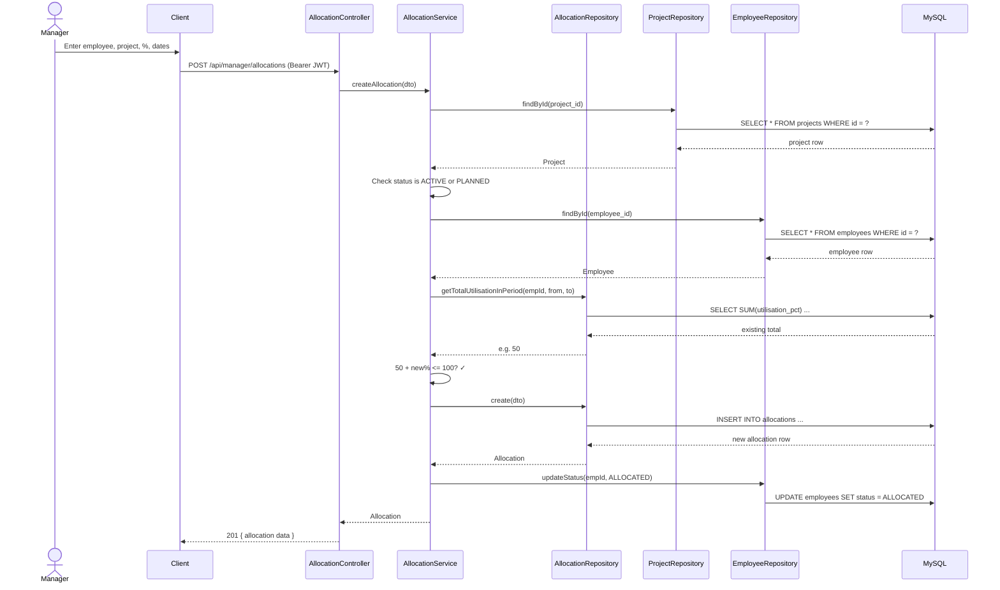

### Submit Timesheet Flow

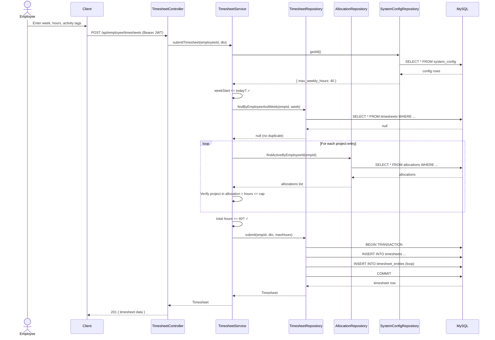

---

## 18. Flow Diagram

### Complete Application Request Flow

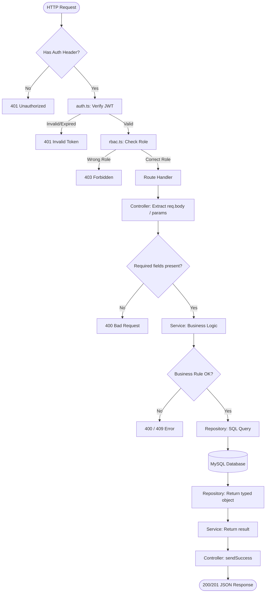

### Allocation Validation Flow

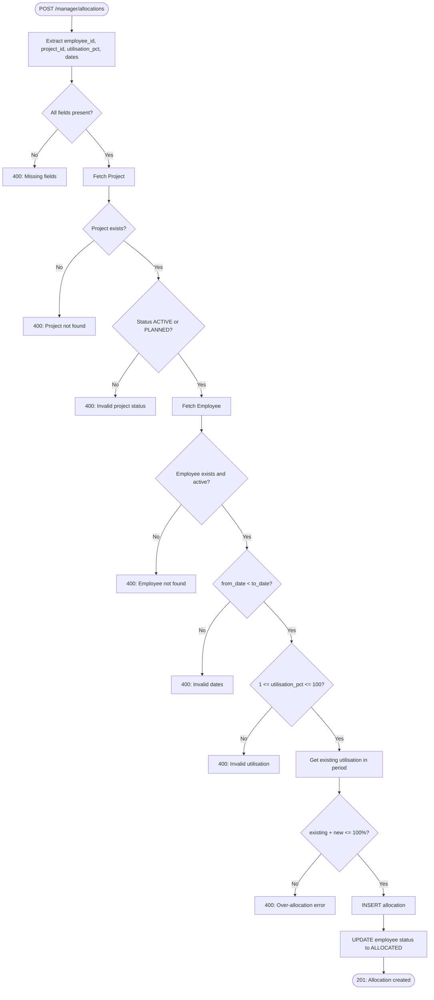

### Project Health Scoring Flow (Scheduler)

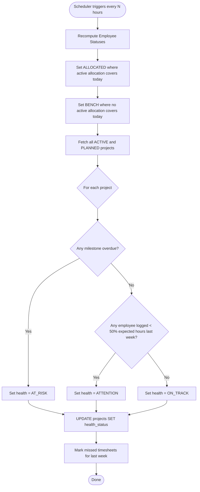

---

## 19. Use-Case Diagram

Actors are shown on the left. Use cases are grouped by role inside the system boundary.
Oval shapes `(["..."])` represent use cases. Arrows show which actor can perform which use case.

```mermaid
flowchart LR
    %% Actors
    A1([" Admin"])
    A2([" Manager"])
    A3([" Employee"])

    %% System boundary
    subgraph PRM ["⬛ PRM Tool System"]

        subgraph AUTH ["Authentication"]
            UC1(["Login"])
            UC2(["Change Password"])
            UC3(["Force Change Password\n(first login)"])
        end

        subgraph ADMIN_UC ["Admin Use Cases"]
            UC4(["Create User Account"])
            UC5(["View All Users"])
            UC6(["Reset User Password"])
            UC7(["Deactivate User"])
            UC8(["Reactivate User"])
            UC9(["Update Employee Profile"])
            UC10(["Deactivate Employee"])
            UC11(["Add / Update / Remove Skill"])
            UC12(["Assign Manager to Employee"])
            UC13(["Create Project"])
            UC14(["Update Project Details"])
            UC15(["Manage Milestones"])
            UC16(["View All Allocations"])
            UC17(["Configure System Settings\n(LLM key, scheduler, max hours)"])
        end

        subgraph MANAGER_UC ["Manager Use Cases"]
            UC18(["View Resource Dashboard\n(bench + allocated team)"])
            UC19(["Drill into Employee Detail"])
            UC20(["Allocate Employee to Project\n(AI-assisted or direct)"])
            UC21(["End Allocation"])
            UC22(["View My Projects + Health Status"])
            UC23(["View Team Timesheets"])
            UC24(["AI Skill Match"])
            UC25(["AI Risk Summary"])
        end

        subgraph EMPLOYEE_UC ["Employee Use Cases"]
            UC26(["Submit Weekly Timesheet\n(hours + activity tags)"])
            UC27(["View My Timesheets"])
            UC28(["View My Allocations"])
        end

    end

    %% Admin connections
    A1 --> UC1
    A1 --> UC2
    A1 --> UC3
    A1 --> UC4
    A1 --> UC5
    A1 --> UC6
    A1 --> UC7
    A1 --> UC8
    A1 --> UC9
    A1 --> UC10
    A1 --> UC11
    A1 --> UC12
    A1 --> UC13
    A1 --> UC14
    A1 --> UC15
    A1 --> UC16
    A1 --> UC17

    %% Manager connections
    A2 --> UC1
    A2 --> UC2
    A2 --> UC3
    A2 --> UC18
    A2 --> UC19
    A2 --> UC20
    A2 --> UC21
    A2 --> UC22
    A2 --> UC23
    A2 --> UC24
    A2 --> UC25

    %% Employee connections
    A3 --> UC1
    A3 --> UC2
    A3 --> UC3
    A3 --> UC26
    A3 --> UC27
    A3 --> UC28
```

---

## 20. UML Diagrams

---

### 20.1 Class Diagram

Shows all classes, their attributes, methods, and relationships (inheritance, dependency, composition).

```mermaid
classDiagram

    %% ── Interfaces (contracts) ─────────────────────────────────

    class IBaseRepository~T~ {
        <<interface>>
        +findById(id: number) Promise~T | null~
        +findAll() Promise~T[]~
        +delete(id: number) Promise~void~
    }

    class IUserRepository {
        <<interface>>
        +findByUsername(username: string) Promise~User | null~
        +findByEmail(email: string) Promise~User | null~
        +create(dto: CreateUserDTO) Promise~User~
        +updatePassword(userId: number, hash: string) Promise~void~
        +setForcePasswordChange(userId: number, value: boolean) Promise~void~
        +setActive(userId: number, isActive: boolean) Promise~void~
    }

    class IEmployeeRepository {
        <<interface>>
        +findByUserId(userId: number) Promise~Employee | null~
        +findAllWithDetails() Promise~EmployeeWithDetails[]~
        +findByManagerId(managerId: number) Promise~EmployeeWithDetails[]~
        +create(dto: CreateEmployeeDTO) Promise~Employee~
        +update(id: number, dto: UpdateEmployeeDTO) Promise~void~
        +setActive(id: number, isActive: boolean) Promise~void~
        +updateStatus(id: number, status: string) Promise~void~
        +assignManager(empId: number, managerId: number) Promise~void~
        +getSkills(employeeId: number) Promise~EmployeeSkillDetail[]~
        +addSkill(empId: number, dto: AddSkillDTO) Promise~void~
        +updateSkill(empId: number, skillId: number, dto: UpdateSkillDTO) Promise~void~
        +removeSkill(empId: number, skillId: number) Promise~void~
    }

    class IProjectRepository {
        <<interface>>
        +findAllWithDetails() Promise~ProjectWithDetails[]~
        +findByManagerId(managerId: number) Promise~ProjectWithDetails[]~
        +create(dto: CreateProjectDTO) Promise~Project~
        +update(id: number, dto: UpdateProjectDTO) Promise~void~
        +updateHealthStatus(id: number, health: HealthStatus) Promise~void~
        +getMilestones(projectId: number) Promise~Milestone[]~
        +addMilestone(projectId: number, dto: CreateMilestoneDTO) Promise~Milestone~
        +updateMilestone(milestoneId: number, dto: UpdateMilestoneDTO) Promise~void~
    }

    class IAllocationRepository {
        <<interface>>
        +findAllWithDetails() Promise~AllocationWithDetails[]~
        +findByEmployeeId(empId: number) Promise~Allocation[]~
        +findByProjectId(projectId: number) Promise~AllocationWithDetails[]~
        +findActiveByEmployeeId(empId: number) Promise~Allocation[]~
        +create(dto: CreateAllocationDTO) Promise~Allocation~
        +endAllocation(id: number, endDate: string) Promise~void~
        +endAllActiveForEmployee(empId: number, endDate: string) Promise~void~
        +getTotalUtilisationInPeriod(empId: number, from: string, to: string) Promise~number~
    }

    class ITimesheetRepository {
        <<interface>>
        +findByEmployeeId(empId: number) Promise~Timesheet[]~
        +findByEmployeeAndWeek(empId: number, week: string) Promise~Timesheet | null~
        +findWithEntries(timesheetId: number) Promise~TimesheetWithEntries | null~
        +findTeamTimesheets(managerEmpId: number, week: string) Promise~TimesheetEntryWithProject[]~
        +submit(empId: number, dto: SubmitTimesheetDTO, maxHours: number) Promise~Timesheet~
        +markMissed(empId: number, weekStart: string) Promise~void~
    }

    class ISystemConfigRepository {
        <<interface>>
        +getAll() Promise~SystemConfigMap~
        +update(dto: UpdateConfigDTO) Promise~void~
    }

    class ILLMProvider {
        <<interface>>
        +skillMatch(context: string) Promise~string~
        +riskSummary(context: string) Promise~string~
    }

    %% ── Repository Implementations ─────────────────────────────

    class UserRepository {
        +findById(id: number) Promise~User | null~
        +findAll() Promise~User[]~
        +findByUsername(username: string) Promise~User | null~
        +findByEmail(email: string) Promise~User | null~
        +create(dto: CreateUserDTO) Promise~User~
        +updatePassword(userId: number, hash: string) Promise~void~
        +setForcePasswordChange(userId: number, value: boolean) Promise~void~
        +setActive(userId: number, isActive: boolean) Promise~void~
        +delete(id: number) Promise~void~
    }

    class EmployeeRepository {
        +findById(id: number) Promise~Employee | null~
        +findAll() Promise~Employee[]~
        +findByUserId(userId: number) Promise~Employee | null~
        +findAllWithDetails() Promise~EmployeeWithDetails[]~
        +findByManagerId(managerId: number) Promise~EmployeeWithDetails[]~
        +create(dto: CreateEmployeeDTO) Promise~Employee~
        +update(id: number, dto: UpdateEmployeeDTO) Promise~void~
        +getSkills(empId: number) Promise~EmployeeSkillDetail[]~
        +addSkill(empId: number, dto: AddSkillDTO) Promise~void~
        +findOrCreateSkill(name: string, category: string) Promise~Skill~
        +delete(id: number) Promise~void~
    }

    class ProjectRepository {
        +findById(id: number) Promise~Project | null~
        +findAll() Promise~Project[]~
        +findAllWithDetails() Promise~ProjectWithDetails[]~
        +findByManagerId(managerId: number) Promise~ProjectWithDetails[]~
        +create(dto: CreateProjectDTO) Promise~Project~
        +update(id: number, dto: UpdateProjectDTO) Promise~void~
        +updateHealthStatus(id: number, health: HealthStatus) Promise~void~
        +getMilestones(projectId: number) Promise~Milestone[]~
        +addMilestone(projectId: number, dto: CreateMilestoneDTO) Promise~Milestone~
        +updateMilestone(milestoneId: number, dto: UpdateMilestoneDTO) Promise~void~
        +delete(id: number) Promise~void~
    }

    class AllocationRepository {
        +findById(id: number) Promise~Allocation | null~
        +findAll() Promise~Allocation[]~
        +findAllWithDetails() Promise~AllocationWithDetails[]~
        +findByEmployeeId(empId: number) Promise~Allocation[]~
        +findByProjectId(projectId: number) Promise~AllocationWithDetails[]~
        +findActiveByEmployeeId(empId: number) Promise~Allocation[]~
        +create(dto: CreateAllocationDTO) Promise~Allocation~
        +endAllocation(id: number, endDate: string) Promise~void~
        +endAllActiveForEmployee(empId: number, endDate: string) Promise~void~
        +getTotalUtilisationInPeriod(empId: number, from: string, to: string) Promise~number~
        +delete(id: number) Promise~void~
    }

    class TimesheetRepository {
        +findById(id: number) Promise~Timesheet | null~
        +findAll() Promise~Timesheet[]~
        +findByEmployeeId(empId: number) Promise~Timesheet[]~
        +findByEmployeeAndWeek(empId: number, week: string) Promise~Timesheet | null~
        +findWithEntries(timesheetId: number) Promise~TimesheetWithEntries | null~
        +findTeamTimesheets(managerEmpId: number, week: string) Promise~TimesheetEntryWithProject[]~
        +submit(empId: number, dto: SubmitTimesheetDTO, maxHours: number) Promise~Timesheet~
        +markMissed(empId: number, weekStart: string) Promise~void~
        +delete(id: number) Promise~void~
    }

    class SystemConfigRepository {
        +getAll() Promise~SystemConfigMap~
        +update(dto: UpdateConfigDTO) Promise~void~
    }

    %% ── Services ───────────────────────────────────────────────

    class AuthService {
        -userRepo: IUserRepository
        -employeeRepo: IEmployeeRepository
        +login(username: string, password: string) Promise~LoginResult~
        +changePassword(userId: number, currentPwd: string, newPwd: string) Promise~void~
        +forceChangePassword(userId: number, newPwd: string) Promise~void~
        -validatePasswordStrength(password: string) void
    }

    class UserService {
        -userRepo: IUserRepository
        -employeeRepo: IEmployeeRepository
        +createUser(dto: CreateUserDTO) Promise~User~
        +getAllUsers() Promise~User[]~
        +resetPassword(userId: number, newPwd: string) Promise~void~
        +deactivateUser(userId: number) Promise~void~
        +reactivateUser(userId: number) Promise~void~
        -validatePasswordStrength(password: string) void
    }

    class EmployeeService {
        -employeeRepo: IEmployeeRepository
        -allocationRepo: IAllocationRepository
        -userRepo: IUserRepository
        +getAllEmployees() Promise~EmployeeWithDetails[]~
        +getEmployeeById(id: number) Promise~EmployeeWithDetails~
        +updateEmployee(id: number, dto: UpdateEmployeeDTO) Promise~void~
        +deactivateEmployee(id: number) Promise~void~
        +getSkills(empId: number) Promise~EmployeeSkillDetail[]~
        +addSkill(empId: number, dto: AddSkillDTO) Promise~void~
        +updateSkill(empId: number, skillId: number, dto: UpdateSkillDTO) Promise~void~
        +removeSkill(empId: number, skillId: number) Promise~void~
        +assignManager(empUserId: number, managerUserId: number) Promise~void~
        +getTeamByManager(managerEmpId: number) Promise~EmployeeWithDetails[]~
    }

    class ProjectService {
        -projectRepo: IProjectRepository
        +getAllProjects() Promise~ProjectWithDetails[]~
        +getProjectById(id: number) Promise~Project~
        +getProjectsByManager(managerId: number) Promise~ProjectWithDetails[]~
        +createProject(dto: CreateProjectDTO) Promise~Project~
        +updateProject(id: number, dto: UpdateProjectDTO) Promise~void~
        +getMilestones(projectId: number) Promise~Milestone[]~
        +addMilestone(projectId: number, dto: CreateMilestoneDTO) Promise~Milestone~
        +updateMilestone(projectId: number, milestoneId: number, dto: UpdateMilestoneDTO) Promise~void~
    }

    class AllocationService {
        -allocationRepo: IAllocationRepository
        -projectRepo: IProjectRepository
        -employeeRepo: IEmployeeRepository
        +getAllAllocations() Promise~AllocationWithDetails[]~
        +getAllocationsByProject(projectId: number) Promise~AllocationWithDetails[]~
        +getAllocationsByEmployee(empId: number) Promise~Allocation[]~
        +createAllocation(dto: CreateAllocationDTO) Promise~Allocation~
        +endAllocation(allocationId: number, managerId: number) Promise~void~
    }

    class TimesheetService {
        -timesheetRepo: ITimesheetRepository
        -allocationRepo: IAllocationRepository
        -configRepo: ISystemConfigRepository
        +submitTimesheet(empId: number, dto: SubmitTimesheetDTO) Promise~Timesheet~
        +getMyTimesheets(empId: number) Promise~Timesheet[]~
        +getTimesheetDetail(empId: number, timesheetId: number) Promise~TimesheetWithEntries~
        +getTeamTimesheets(managerEmpId: number, weekStart: string) Promise~any[]~
        +getMissedWeekForEmployee(empId: number) Promise~string | null~
    }

    class ConfigService {
        -configRepo: ISystemConfigRepository
        +getConfig() Promise~SystemConfigMap~
        +updateConfig(dto: UpdateConfigDTO) Promise~void~
    }

    class AIService {
        -configRepo: ISystemConfigRepository
        -employeeRepo: IEmployeeRepository
        -allocationRepo: IAllocationRepository
        -projectRepo: IProjectRepository
        -timesheetRepo: ITimesheetRepository
        +skillMatch(managerEmpId: number, requirement: string, projectId: number) Promise~string~
        +riskSummary(projectId: number) Promise~string~
    }

    %% ── AI Providers ───────────────────────────────────────────

    class GeminiProvider {
        -apiKey: string
        -apiUrl: string
        +skillMatch(context: string) Promise~string~
        +riskSummary(context: string) Promise~string~
        -buildSkillMatchPrompt(context: string) string
        -buildRiskSummaryPrompt(context: string) string
        -call(prompt: string) Promise~string~
    }

    class GroqProvider {
        -apiKey: string
        -apiUrl: string
        -model: string
        +skillMatch(context: string) Promise~string~
        +riskSummary(context: string) Promise~string~
        -call(systemPrompt: string, userContent: string) Promise~string~
    }

    class LLMFactory {
        +create(provider: LLMProvider, apiKey: string)$ ILLMProvider
    }

    %% ── Database Singleton ─────────────────────────────────────

    class Database {
        -instance: Pool$
        +getInstance()$ Pool
    }

    %% ── Inheritance: Repositories implement interfaces ──────────

    IBaseRepository <|.. UserRepository : implements
    IBaseRepository <|.. EmployeeRepository : implements
    IBaseRepository <|.. ProjectRepository : implements
    IBaseRepository <|.. AllocationRepository : implements
    IBaseRepository <|.. TimesheetRepository : implements

    IUserRepository <|.. UserRepository : implements
    IEmployeeRepository <|.. EmployeeRepository : implements
    IProjectRepository <|.. ProjectRepository : implements
    IAllocationRepository <|.. AllocationRepository : implements
    ITimesheetRepository <|.. TimesheetRepository : implements
    ISystemConfigRepository <|.. SystemConfigRepository : implements
    ILLMProvider <|.. GeminiProvider : implements
    ILLMProvider <|.. GroqProvider : implements

    IUserRepository <|-- IUserRepository : extends IBaseRepository

    %% ── Dependencies: Services depend on interfaces (DIP) ───────

    AuthService ..> IUserRepository : depends on
    AuthService ..> IEmployeeRepository : depends on
    UserService ..> IUserRepository : depends on
    UserService ..> IEmployeeRepository : depends on
    EmployeeService ..> IEmployeeRepository : depends on
    EmployeeService ..> IAllocationRepository : depends on
    EmployeeService ..> IUserRepository : depends on
    ProjectService ..> IProjectRepository : depends on
    AllocationService ..> IAllocationRepository : depends on
    AllocationService ..> IProjectRepository : depends on
    AllocationService ..> IEmployeeRepository : depends on
    TimesheetService ..> ITimesheetRepository : depends on
    TimesheetService ..> IAllocationRepository : depends on
    TimesheetService ..> ISystemConfigRepository : depends on
    ConfigService ..> ISystemConfigRepository : depends on
    AIService ..> ISystemConfigRepository : depends on
    AIService ..> IEmployeeRepository : depends on
    AIService ..> IAllocationRepository : depends on
    AIService ..> IProjectRepository : depends on
    AIService ..> ITimesheetRepository : depends on
    AIService ..> LLMFactory : uses
    LLMFactory ..> ILLMProvider : creates
    LLMFactory ..> GeminiProvider : creates
    LLMFactory ..> GroqProvider : creates

    %% ── Singleton ───────────────────────────────────────────────
    UserRepository ..> Database : uses pool
    EmployeeRepository ..> Database : uses pool
    ProjectRepository ..> Database : uses pool
    AllocationRepository ..> Database : uses pool
    TimesheetRepository ..> Database : uses pool
    SystemConfigRepository ..> Database : uses pool
```

---

### 20.2 State Diagram — Employee Status

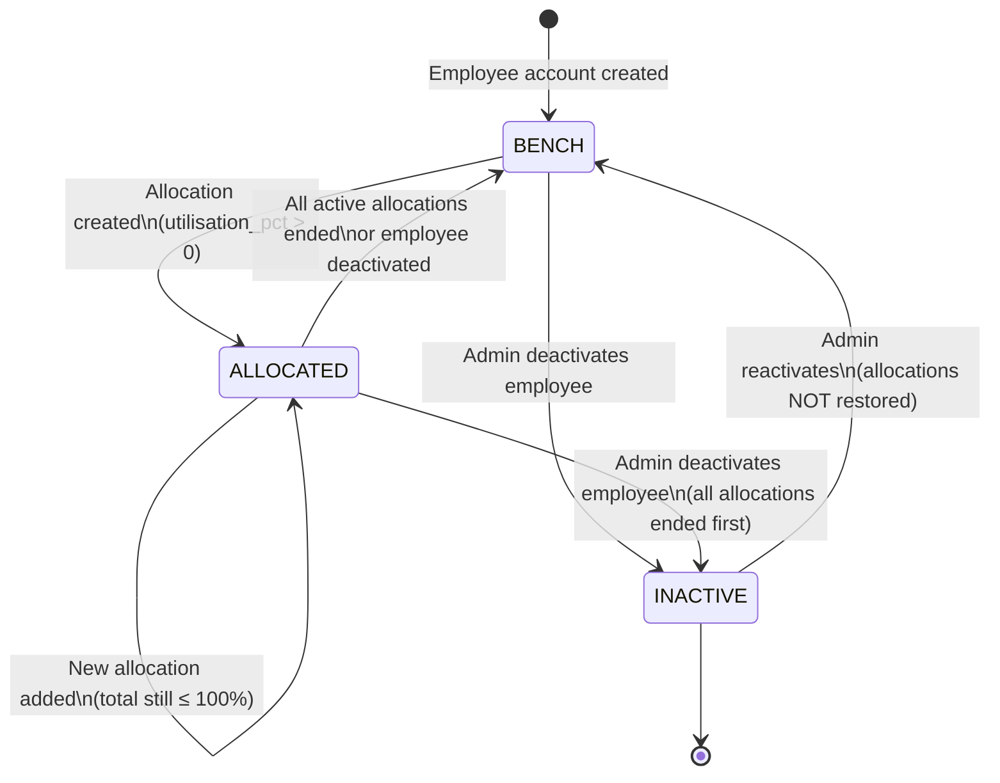

---

### 20.3 State Diagram — Project Status

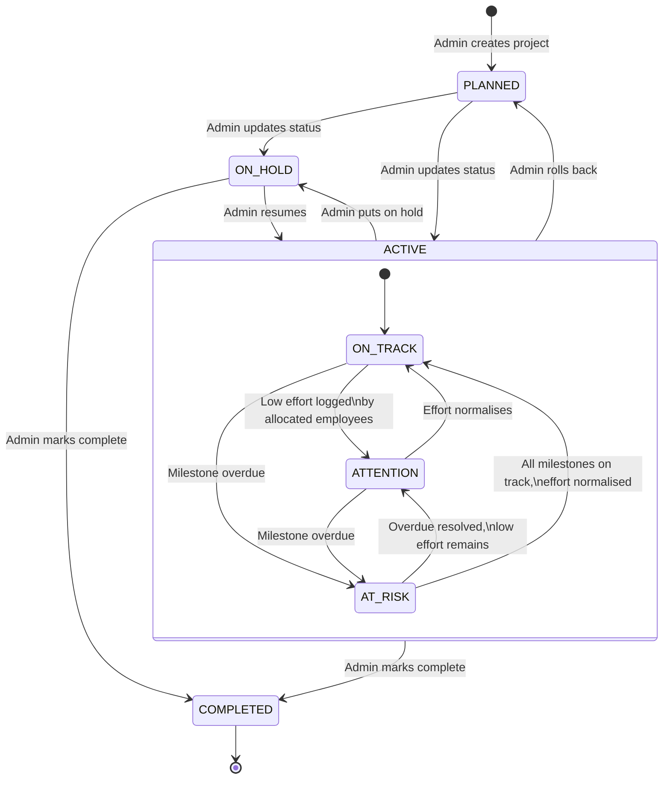

---

### 20.4 State Diagram — Milestone Status

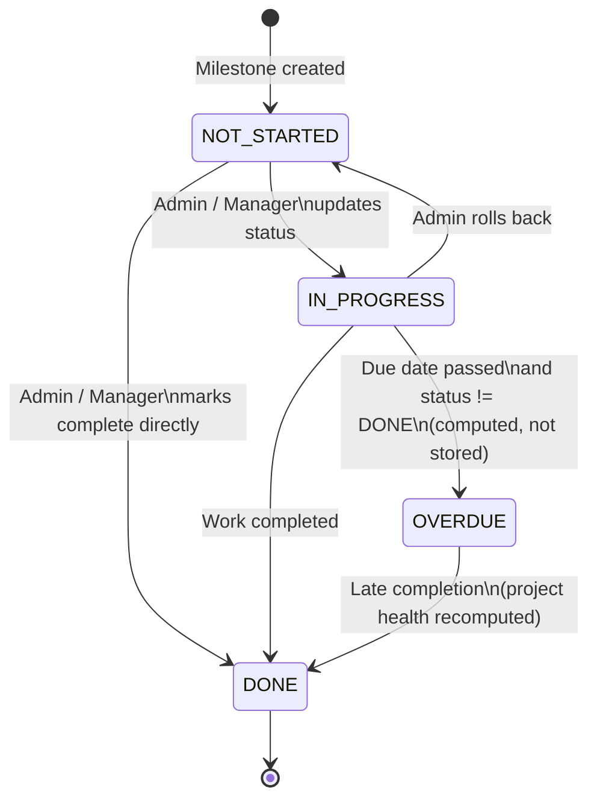

---

### 20.5 State Diagram — Timesheet Status

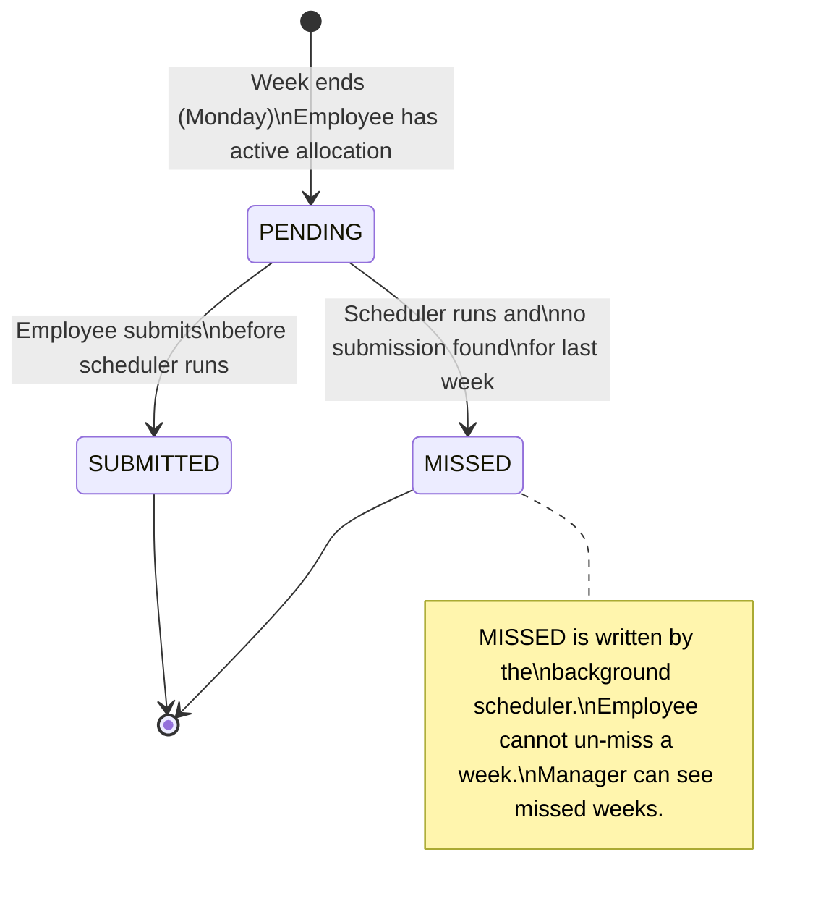

---

### 20.6 State Diagram — User Account Status

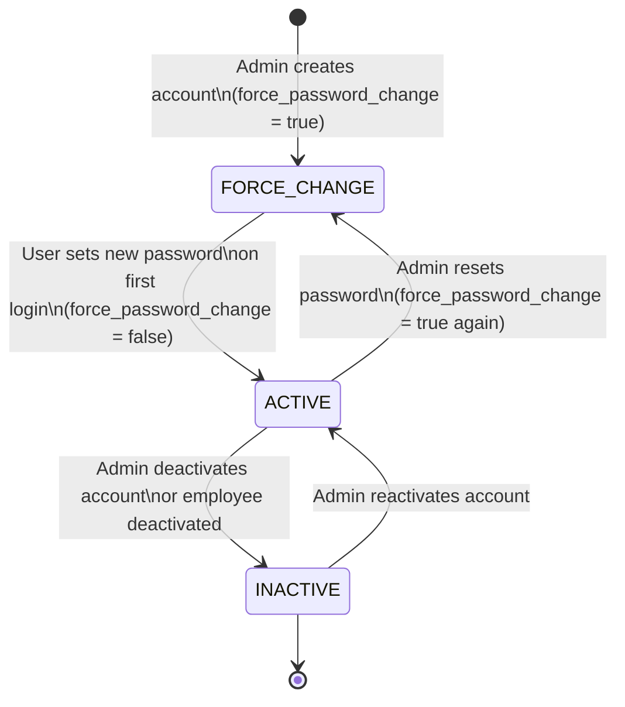

---

### 20.7 Component Diagram

Shows how the major system components connect to each other.

```mermaid
flowchart TB
    subgraph Client["Console Client (built later)"]
        CLI[TypeScript CLI\nreadline / prompts]
    end

    subgraph Server["REST API Server — Express + TypeScript"]
        subgraph Middleware["Middleware Layer"]
            AUTH[auth.ts\nJWT verify]
            RBAC[rbac.ts\nRole guard]
            VAL[validation.ts\nFail Fast]
            ERR[errorHandler.ts\nGlobal catch]
        end

        subgraph Routes["Route Layer"]
            R1[auth.routes]
            R2[admin.routes]
            R3[manager.routes]
            R4[employee.routes]
        end

        subgraph Controllers["Controller Layer"]
            C1[AuthController]
            C2[UserController]
            C3[EmployeeController]
            C4[ProjectController]
            C5[AllocationController]
            C6[TimesheetController]
            C7[DashboardController]
            C8[ConfigController]
            C9[AIController]
        end

        subgraph Services["Service Layer"]
            S1[AuthService]
            S2[UserService]
            S3[EmployeeService]
            S4[ProjectService]
            S5[AllocationService]
            S6[TimesheetService]
            S7[ConfigService]
            S8[AIService]
        end

        subgraph Repositories["Repository Layer"]
            RI1[IUserRepository]
            RI2[IEmployeeRepository]
            RI3[IProjectRepository]
            RI4[IAllocationRepository]
            RI5[ITimesheetRepository]
            RI6[ISystemConfigRepository]
        end

        subgraph RepoImpl["Repository Implementations"]
            RIMPL1[UserRepository]
            RIMPL2[EmployeeRepository]
            RIMPL3[ProjectRepository]
            RIMPL4[AllocationRepository]
            RIMPL5[TimesheetRepository]
            RIMPL6[SystemConfigRepository]
        end

        subgraph AI["AI Layer"]
            FACT[LLMFactory]
            GEM[GeminiProvider]
            GROQ[GroqProvider]
        end

        subgraph Scheduler["Background Scheduler"]
            SCHED[node-cron\nScheduler]
        end

        DB_CONN[Database\nSingleton Pool]
    end

    subgraph External["External Systems"]
        MYSQL[(MySQL 8.0)]
        GEMINI_API[Google Gemini API]
        GROQ_API[Groq API]
    end

    CLI -->|HTTP REST| Routes
    Routes --> Middleware
    Middleware --> Controllers
    Controllers --> Services
    Services --> Repositories
    Repositories --> RepoImpl
    RepoImpl --> DB_CONN
    DB_CONN --> MYSQL

    Services --> AI
    AI --> FACT
    FACT --> GEM
    FACT --> GROQ
    GEM -->|HTTPS| GEMINI_API
    GROQ -->|HTTPS| GROQ_API

    Scheduler --> DB_CONN
    Scheduler -->|reads config| MYSQL
```

---

## 21. Postman Testing Guide

This guide walks through every API in the correct order. Copy-paste the JSON bodies exactly.

### Prerequisites
- Server running: `npm run dev` in `server/` folder
- Schema applied: run `001_schema.sql` in MySQL Workbench
- Seed script run: `npx ts-node src/database/seeds/seed.ts`
- Base URL: `http://localhost:3000`

### Seeded Department IDs (from schema migration)
| id | name | type |
|---|---|---|
| 1 | Operations | OPERATIONS |
| 2 | Management | MANAGEMENT |
| 3 | Software Engineering | ENGINEERING |
| 4 | Testing & QA | TESTING |
| 5 | DevOps | DEVOPS |
| 6 | Design | DESIGN |

Use these `department_id` values when creating employees.

---

### Step 1 — Login as Admin (First Login)

**POST** `http://localhost:3000/api/auth/login`

Headers: `Content-Type: application/json`

Body:
```json
{
  "username": "admin",
  "password": "Admin@1234"
}
```

Expected Response:
```json
{
  "success": true,
  "data": {
    "token": "<JWT_TOKEN>",
    "forcePasswordChange": true,
    "role": "ADMIN",
    "fullName": "System Admin"
  }
}
```

> Copy the `token` value. Use it as `Bearer <token>` in the Authorization header for all subsequent requests.

---

### Step 2 — Force Change Admin Password

**POST** `http://localhost:3000/api/auth/force-change-password`

Headers:
- `Content-Type: application/json`
- `Authorization: Bearer <token from Step 1>`

Body:
```json
{
  "newPassword": "Admin@9999"
}
```

Expected:
```json
{ "success": true, "data": { "message": "Password updated. You can now access the system." } }
```

> Login again with the new password to get a fresh token.

---

### Step 3 — Login Again with New Password

**POST** `http://localhost:3000/api/auth/login`

Body:
```json
{
  "username": "admin",
  "password": "Admin@9999"
}
```

> Save the new token. `forcePasswordChange` should now be `false`.

---

### Step 4 — Create a Manager

**POST** `http://localhost:3000/api/admin/employees`

Headers: `Authorization: Bearer <admin token>`

Body:
```json
{
  "username": "ankit.shah",
  "email": "ankit.shah@company.com",
  "password": "Manager@1234",
  "role": "MANAGER",
  "full_name": "Ankit Shah",
  "department_id": 2
}
```

Expected: `201` with employee object. Note the `id` (e.g., `2`).

---

### Step 5 — Create a Resource

**POST** `http://localhost:3000/api/admin/employees`

Headers: `Authorization: Bearer <admin token>`

Body:
```json
{
  "username": "ravi.kumar",
  "email": "ravi.kumar@company.com",
  "password": "Resource@1234",
  "role": "RESOURCE",
  "full_name": "Ravi Kumar",
  "department_id": 3
}
```

Expected: `201` with employee object. Note the `id` (e.g., `3`).

---

### Step 6 — Create Another Resource

**POST** `http://localhost:3000/api/admin/employees`

Body:
```json
{
  "username": "priya.mehta",
  "email": "priya.mehta@company.com",
  "password": "Resource@1234",
  "role": "RESOURCE",
  "full_name": "Priya Mehta",
  "department_id": 4
}
```

---

### Step 7 — View All Employees

**GET** `http://localhost:3000/api/admin/employees`

Headers: `Authorization: Bearer <admin token>`

Expected: All 4 employees (admin, manager, ravi, priya) with `department_name`, `role`, `status`, and `skills`.

---

### Step 8 — Update Employee Profile

**PUT** `http://localhost:3000/api/admin/employees/3`

Body:
```json
{
  "full_name": "Ravi Kumar Sharma",
  "department_id": 3
}
```

Expected: `200 { "message": "Employee updated." }`

---

### Step 9 — Add a Skill to Resource

**POST** `http://localhost:3000/api/admin/employees/3/skills`

Body:
```json
{
  "skill_name": "Java",
  "category": "BACKEND",
  "proficiency": "ADVANCED"
}
```

Expected: `201 { "message": "Skill added." }`

Add another skill:

```json
{
  "skill_name": "Spring Boot",
  "category": "BACKEND",
  "proficiency": "INTERMEDIATE"
}
```

---

### Step 10 — Add Skill to Manager

**POST** `http://localhost:3000/api/admin/employees/2/skills`

Body:
```json
{
  "skill_name": "Project Management",
  "category": "OTHER",
  "proficiency": "EXPERT"
}
```

---

### Step 11 — Create a Project

**POST** `http://localhost:3000/api/admin/projects`

Headers: `Authorization: Bearer <admin token>`

Body:
```json
{
  "name": "Alpha Portal",
  "description": "Customer web portal",
  "start_date": "2026-01-01",
  "end_date": "2026-09-30",
  "status": "ACTIVE",
  "manager_id": 2,
  "total_story_points": 120
}
```

Expected: `201` with project object. Note the project `id` (e.g., `1`).

> `manager_id` is the employee `id` of the Manager (from `employees` table), not the user_account id.

---

### Step 12 — Add Milestones to Project

**POST** `http://localhost:3000/api/admin/projects/1/milestones`

Body:
```json
{
  "title": "Design Complete",
  "due_date": "2026-07-01",
  "story_points": 20
}
```

Add a second milestone:
```json
{
  "title": "Backend API",
  "due_date": "2026-08-15",
  "story_points": 40
}
```

---

### Step 13 — Login as Manager

**POST** `http://localhost:3000/api/auth/login`

Body:
```json
{
  "username": "ankit.shah",
  "password": "Manager@1234"
}
```

> `forcePasswordChange: true` will be returned. Hit force-change-password (same as Step 2), then login again. Save the Manager token.

---

### Step 14 — View Resource Dashboard (Manager)

**GET** `http://localhost:3000/api/manager/dashboard`

Headers: `Authorization: Bearer <manager token>`

Expected:
```json
{
  "total": 2,
  "bench": 2,
  "allocated": 0,
  "employees": [...]
}
```

---

### Step 15 — Allocate Resource to Project

**POST** `http://localhost:3000/api/manager/allocations`

Headers: `Authorization: Bearer <manager token>`

Body:
```json
{
  "employee_id": 3,
  "project_id": 1,
  "utilisation_pct": 50,
  "from_date": "2026-06-11",
  "to_date": "2026-09-30"
}
```

Expected: `201` with allocation object.

Try allocating the same employee at 60% in the same period — should get **400 Over-allocation error**.

---

### Step 16 — Verify Dashboard Shows ALLOCATED

**GET** `http://localhost:3000/api/manager/dashboard`

Expected: Ravi now shows `status: "ALLOCATED"` — status is derived live from allocations.

---

### Step 17 — Login as Resource

**POST** `http://localhost:3000/api/auth/login`

Body:
```json
{
  "username": "ravi.kumar",
  "password": "Resource@1234"
}
```

> Force-change password (same flow as Steps 2–3), then login again. Save the Resource token.

---

### Step 18 — View My Allocations (Resource)

**GET** `http://localhost:3000/api/resource/allocations`

Headers: `Authorization: Bearer <resource token>`

Expected: The allocation created in Step 15.

---

### Step 19 — Submit Timesheet (Resource)

**POST** `http://localhost:3000/api/resource/timesheets`

Headers: `Authorization: Bearer <resource token>`

Body:
```json
{
  "week_start_date": "2026-06-09",
  "entries": [
    {
      "project_id": 1,
      "hours_worked": 20,
      "activity_tags": ["Backend API Development", "Code Review"]
    }
  ]
}
```

Expected: `201` with timesheet object.

Try submitting again for the same week — should get **400 already submitted**.

---

### Step 20 — View My Timesheets (Resource)

**GET** `http://localhost:3000/api/resource/timesheets`

Headers: `Authorization: Bearer <resource token>`

Expected: List of timesheets with `missed_week_reminder` if last week was not submitted.

---

### Step 21 — View Team Timesheets (Manager)

**GET** `http://localhost:3000/api/manager/timesheets?week=2026-06-09`

Headers: `Authorization: Bearer <manager token>`

Expected: Timesheet entries for all RESOURCE employees for that week.

---

### Step 22 — Update Milestone Status (Admin)

**PUT** `http://localhost:3000/api/admin/projects/1/milestones/1`

Headers: `Authorization: Bearer <admin token>`

Body:
```json
{
  "status": "DONE"
}
```

---

### Step 23 — Reset an Employee's Password (Admin)

**PUT** `http://localhost:3000/api/admin/employees/3/reset-password`

Body:
```json
{
  "newPassword": "NewPass@999"
}
```

Expected: `200 { "message": "Password reset. Employee will be prompted to change it on next login." }`

---

### Step 24 — Deactivate an Employee (Admin)

**PUT** `http://localhost:3000/api/admin/employees/4/deactivate`

Expected: `200 { "message": "Employee deactivated.", "allocations_ended": 0 }`

All active allocations are ended automatically. User account is also deactivated.

---

### Step 25 — Reactivate an Employee (Admin)

**PUT** `http://localhost:3000/api/admin/employees/4/reactivate`

Expected: `200 { "message": "Employee reactivated." }`

---

### Step 26 — View System Config (Admin)

**GET** `http://localhost:3000/api/admin/config`

Expected:
```json
{
  "llm_provider": "gemini",
  "llm_api_key": "****",
  "scheduler_interval": 4,
  "max_weekly_hours": 40
}
```

---

### Step 27 — Set LLM API Key (Admin)

**PUT** `http://localhost:3000/api/admin/config`

Body:
```json
{
  "llm_provider": "gemini",
  "llm_api_key": "YOUR_GEMINI_API_KEY_HERE"
}
```

---

### Step 28 — AI Skill Match (Manager)

**POST** `http://localhost:3000/api/manager/ai/skill-match`

Headers: `Authorization: Bearer <manager token>`

Body:
```json
{
  "requirement": "I need a backend Java developer with Spring Boot experience for 3 months",
  "project_id": 1
}
```

Expected: `{ "result": "AI-generated ranked list of matching available employees..." }`

---

### Step 29 — AI Risk Summary (Manager)

**POST** `http://localhost:3000/api/manager/ai/risk-summary`

Headers: `Authorization: Bearer <manager token>`

Body:
```json
{
  "project_id": 1
}
```

Expected: `{ "result": "AI-generated plain English risk analysis for the project..." }`

---

### Common Error Scenarios to Test

| Test | Expected |
|---|---|
| Login with wrong password | `401 Invalid username or password` |
| Hit `/api/admin/employees` with Manager token | `403 Access denied` |
| Hit `/api/resource/timesheets` with Manager token | `403 Access denied` |
| Submit timesheet for a future week | `400 Cannot submit a timesheet for a future week` |
| Submit duplicate timesheet same week | `400 already submitted` |
| Allocate resource beyond 100% | `400 Over-allocation: ...` |
| Allocate to a COMPLETED project | `400 Can only allocate to ACTIVE or PLANNED projects` |
| Hit any protected route without token | `401 No token provided` |
| Create employee with duplicate username | `400 Username already taken` |
| Create employee with duplicate email | `400 Email already registered` |
| Weak password (no uppercase/number) | `400 Password must contain...` |

---

---

## 22. Getting Started — Full Setup from Scratch

Follow these steps exactly, in order. Estimated time: 10 minutes.

### Prerequisites

| Tool | Version | Check |
|---|---|---|
| Node.js | v18 or higher (v24 recommended) | `node -v` |
| npm | v8 or higher | `npm -v` |
| MySQL | 8.0 | `mysql --version` |
| MySQL Workbench | Any | GUI for running the schema SQL |

---

### Step 1 — Create the project folder structure

```
prm-tool/
├── server/        ← Express API (already built)
└── client/        ← Console client (already built)
```

---

### Step 2 — Set up the server

```bash
cd prm-tool/server
npm install
```

Create the `.env` file in `server/`:

```env
PORT=3000
NODE_ENV=development
DB_HOST=localhost
DB_PORT=3306
DB_USER=root
DB_PASSWORD="your_mysql_password"
DB_NAME=prm_tool
JWT_SECRET=your_very_long_random_secret_string
JWT_EXPIRES_IN=8h
```

> **Note:** If your password contains `#`, wrap it in double quotes — dotenv treats unquoted `#` as a comment.

---

### Step 3 — Create the database schema

1. Open **MySQL Workbench**
2. Connect to your local MySQL server
3. Open file `server/src/database/migrations/001_schema.sql`
4. Click **Execute** (lightning bolt icon) — this creates the `prm_tool` database and all 15 tables with seed data (departments, roles, permissions, role-permission mappings)

Verify by running in Workbench:
```sql
USE prm_tool;
SHOW TABLES;
-- Should list: departments, employees, roles, employee_roles, user_accounts,
--              skills, employee_skills, projects, milestones, allocations,
--              timesheets, timesheet_entries, system_config, permissions, role_permissions
```

---

### Step 4 — Seed the Admin account

```bash
cd prm-tool/server
npx ts-node src/database/seeds/seed.ts
```

Expected output:
```
[Seed] Admin employee created: id=1
[Seed] User account created for admin
[Seed] Admin role assigned
[Seed] Done.
```

This creates:
- Employee record in `employees` table (dept: Operations)
- Login record in `user_accounts` with bcrypt-hashed password + `force_password_change = true`
- Role assignment in `employee_roles`

Default credentials: `admin` / `Admin@1234`

---

### Step 5 — Start the server

```bash
cd prm-tool/server
npm run dev
```

Expected startup output:
```
Database connection established.
[Permissions] Loaded 26 role-permission mappings from DB.
PRM Tool server running on http://localhost:3000
Environment: development
[Scheduler] Started — health check every 4 hours
```

> The `[Permissions] Loaded 26...` line proves that the server read the `role_permissions` table at startup and cached all RBAC rules in memory.

---

### Step 6 — Start the console client (separate terminal)

```bash
cd prm-tool/client
npm install        # first time only
npm start
```

The login screen appears immediately. Log in with `admin` / `Admin@1234`. You will be forced to set a new password on first login.

---

### Step 7 — Verify end-to-end

1. Client login screen appears
2. Enter `admin` / `Admin@1234`
3. Client calls `POST http://localhost:3000/api/auth/login`
4. Server responds with `{ token, forcePasswordChange: true, role: "ADMIN", ... }`
5. Client detects `forcePasswordChange: true` → shows "Set New Password" screen
6. You set a new password → client calls `POST /api/auth/force-change-password`
7. Admin menu appears — you are now in the system

---

## 23. Console Client — Architecture & How It Connects to the Server

### Folder structure

```
client/
└── src/
    ├── config/
    │   └── config.ts          # BASE_URL = 'http://localhost:3000'
    ├── api/
    │   ├── api.ts             # Generic fetch wrapper (handles auth headers + errors)
    │   ├── auth.api.ts        # login(), changePassword(), forceChangePassword()
    │   ├── admin.api.ts       # getAllEmployees(), createEmployee(), ...
    │   ├── manager.api.ts     # getDashboard(), createAllocation(), ...
    │   └── resource.api.ts    # getMyAllocations(), submitTimesheet(), ...
    ├── session/
    │   └── session.ts         # In-memory JWT store (set/get/clear)
    ├── utils/
    │   ├── display.ts         # ANSI colours, printBanner(), printTable(), ...
    │   └── prompt.ts          # readLine(), readPassword() (masked), confirm()
    └── screens/
        ├── auth/
        │   ├── login.screen.ts          # Username + password form → calls login API
        │   └── changePassword.screen.ts # Force-change + voluntary change
        ├── admin/
        │   └── admin.menu.ts   # Employees, Projects, Config sub-menus
        ├── manager/
        │   └── manager.menu.ts # Dashboard, Allocations, AI tools
        └── resource/
            └── resource.menu.ts # My allocations, submit timesheet
```

### How the client connects to the server

Every HTTP call goes through a single function in `api/api.ts`:

```typescript
// api.ts — the single HTTP gateway
export async function apiCall<T>(method, path, body?): Promise<T> {
  // 1. Build headers — always add Content-Type
  const headers = { 'Content-Type': 'application/json' };

  // 2. Attach JWT from session if the user is logged in
  const token = session.getToken();
  if (token) headers['Authorization'] = `Bearer ${token}`;

  // 3. Call the server using Node 24's built-in fetch
  const response = await fetch(`http://localhost:3000${path}`, {
    method, headers, body: JSON.stringify(body),
    signal: AbortController.signal   // 10 second timeout
  });

  // 4. Parse the server's standard { success, data, message } envelope
  const json = await response.json();

  // 5. If success=false, throw an ApiError — screens catch it and printError()
  if (!json.success) throw new ApiError(json.message, response.status);

  return json.data;
}
```

**The key insight:** Every server response follows the same shape:
```json
{ "success": true, "data": { ... }, "message": "Done" }
```
The client always unwraps `.data` on success, or throws the `.message` on failure.

### Session management

```typescript
// session.ts — JWT lives here for the lifetime of the process
let current: SessionData | null = null;

export const session = {
  set(data): void  { current = data; },
  getToken(): string | null { return current?.token ?? null; },
  clear(): void    { current = null; },
};
```

No file system, no cookies — the token only lives in RAM. When the user logs out or the process exits, the token is gone. On next run, they must log in again.

### Screen routing

```
index.ts
  └── showLoginScreen()          ← loops forever
        ├── login API → forcePasswordChange? → showForceChangePasswordScreen()
        └── role switch:
              ADMIN    → showAdminMenu()
              MANAGER  → showManagerMenu()
              RESOURCE → showResourceMenu()
        └── on logout → session.clear() → back to login
```

Each menu is an `async while(true)` loop — it keeps showing itself until the user picks `[0] Logout`, at which point it `return`s and control flows back up to `showLoginScreen()`.

---

## 24. Auth Deep Dive — Every Method Traced End-to-End

This section traces every auth operation from the user typing on screen, through the API, through every layer of the server, down to the SQL executed on MySQL, and back.

---

### A. Login (first login or returning login)

**1. Console client** — `login.screen.ts`
```
User types: username = "admin", password = "Admin@1234"
→ calls login("admin", "Admin@1234")
→ api.ts: POST /api/auth/login  { username: "admin", password: "Admin@1234" }
```

**2. Express Router** — `auth.routes.ts`
```
POST /api/auth/login → authController.login(req, res)
No middleware on this route — it is public (no JWT needed yet)
```

**3. Controller** — `auth.controller.ts`
```typescript
async login(req, res) {
  const { username, password } = req.body;
  const result = await this.authService.login(username, password);
  sendSuccess(res, result);   // wraps in { success: true, data: result }
}
```

**4. Service** — `auth.service.ts`
```typescript
async login(username, password) {
  // Step 4a — Find user account
  const account = await this.userRepo.findByUsername(username);
  if (!account) throw new Error("Invalid username or password");

  // Step 4b — Verify password
  const valid = await bcrypt.compare(password, account.password_hash);
  if (!valid) throw new Error("Invalid username or password");

  // Step 4c — Check if account is active
  if (!account.is_active) throw new Error("Account is deactivated");

  // Step 4d — Get employee record (name, etc.)
  const employee = await this.employeeRepo.findById(account.employee_id);

  // Step 4e — Get role from employee_roles table
  const role = await this.employeeRoleRepo.getRoleForEmployee(account.employee_id);

  // Step 4f — Sign JWT
  const token = jwt.sign(
    { userAccountId: account.id, employeeId: employee.id, username, role },
    JWT_SECRET,
    { expiresIn: '8h' }
  );

  return { token, forcePasswordChange: account.force_password_change, role,
           employeeId: employee.id, username, fullName: employee.full_name };
}
```

**5. SQL queries executed (in order)**

```sql
-- Step 4a: find user account
SELECT id, employee_id, username, password_hash, force_password_change, is_active
FROM user_accounts
WHERE username = 'admin';

-- Step 4d: get employee record
SELECT id, department_id, full_name, email, is_active FROM employees WHERE id = 1;

-- Step 4e: get role
SELECT r.name AS role_name
FROM employee_roles er
JOIN roles r ON er.role_id = r.id
WHERE er.employee_id = 1;
```

**6. JWT payload** (decoded — never send raw to client)
```json
{
  "userAccountId": 1,
  "employeeId": 1,
  "username": "admin",
  "role": "ADMIN",
  "iat": 1717200000,
  "exp": 1717228800
}
```

**7. Response back to client**
```json
{
  "success": true,
  "data": {
    "token": "eyJhbGci...",
    "forcePasswordChange": true,
    "role": "ADMIN",
    "employeeId": 1,
    "username": "admin",
    "fullName": "System Administrator"
  }
}
```

**8. Client** — `login.screen.ts`
```
Receives response → session.set({ token, role, employeeId, ... })
Detects forcePasswordChange: true
→ shows "Set New Password" screen BEFORE the admin menu
```

---

### B. Force Password Change (first login only)

**Trigger:** `force_password_change = true` in the `user_accounts` table. The seed script sets this to `true` for every newly created account. It becomes `false` permanently after the user sets their own password.

**1. Console client** — `changePassword.screen.ts`
```
User types: newPassword = "NewPass@99", confirmPassword = "NewPass@99"
→ forceChangePassword("NewPass@99")
→ api.ts: POST /api/auth/force-change-password
  Headers: Authorization: Bearer <token>
  Body: { newPassword: "NewPass@99" }
```

**2. Middleware** — `auth.ts`
```typescript
// Runs FIRST on every protected route
const token = req.headers.authorization?.split(' ')[1];
const payload = jwt.verify(token, JWT_SECRET);
req.user = payload;   // { userAccountId, employeeId, username, role }
next();
```

**3. Controller** — `auth.controller.ts`
```typescript
async forceChangePassword(req, res) {
  const { newPassword } = req.body;
  // req.user is set by auth middleware — no need to pass credentials again
  await this.authService.forceChangePassword(req.user.userAccountId, newPassword);
  sendSuccess(res, null, "Password updated.");
}
```

**4. Service** — `auth.service.ts`
```typescript
async forceChangePassword(userAccountId, newPassword) {
  validatePasswordStrength(newPassword);  // 8+ chars, uppercase, number
  const hash = await bcrypt.hash(newPassword, 10);
  await this.userRepo.forceChangePassword(userAccountId, hash);
}
```

**5. SQL executed**
```sql
-- Atomically update password AND clear the force-change flag
UPDATE user_accounts
SET    password_hash = '$2b$10$...(bcrypt hash)...',
       force_password_change = false
WHERE  id = 1;
```

**6. Back on the client**
```
Response: { success: true }
→ printSuccess("Password updated. Continuing…")
→ showAdminMenu() is called — now the user enters the system
```

---

### C. Change Password (voluntary, from any role menu)

**Difference from force-change:** The user must prove they know the *current* password first.

**1. Client** — picks `[4] Change My Password` from any menu
```
User types: currentPassword = "NewPass@99"
            newPassword     = "AnotherPass@1"
            confirmPassword = "AnotherPass@1"
→ changePassword("NewPass@99", "AnotherPass@1")
→ POST /api/auth/change-password  { currentPassword, newPassword }
```

**2. Service** — `auth.service.ts`
```typescript
async changePassword(userAccountId, currentPassword, newPassword) {
  // Fetch account to re-verify the current password
  const account = await this.userRepo.findById(userAccountId);
  const valid = await bcrypt.compare(currentPassword, account.password_hash);
  if (!valid) throw new Error("Current password is incorrect");

  validatePasswordStrength(newPassword);
  const hash = await bcrypt.hash(newPassword, 10);
  await this.userRepo.updatePassword(userAccountId, hash);
}
```

**3. SQL executed**
```sql
-- Read current hash to verify
SELECT password_hash FROM user_accounts WHERE id = 1;

-- If bcrypt.compare passes, write the new hash
UPDATE user_accounts
SET    password_hash = '$2b$10$...(new bcrypt hash)...'
WHERE  id = 1;
```

---

### D. Admin Resets an Employee's Password

Admin picks `[4] Reset Employee Password` from the admin menu.

**SQL executed:**
```sql
-- Set new hash AND re-arm force_password_change
UPDATE user_accounts
SET    password_hash = '$2b$10$...',
       force_password_change = true
WHERE  employee_id = 3;
```

The employee will be forced to change their password on their next login — same flow as first login.

---

### E. How the Permission System Works at Login Time

When the **server starts** (not at each request), it runs:

```typescript
// server.ts
const permMap = await new PermissionRepository().loadRolePermissions();
setRolePermissions(permMap);
```

SQL executed **once at startup**:
```sql
SELECT r.name  AS role_name,
       p.name  AS permission_name
FROM   role_permissions rp
JOIN   roles      r ON rp.role_id      = r.id
JOIN   permissions p ON rp.permission_id = p.id;
```

This builds an in-memory `Map<role, Set<permissions>>`:
```
"ADMIN"    → { "employee:create", "employee:read_all", "project:create", ... } (14 permissions)
"MANAGER"  → { "dashboard:read", "allocation:create", "ai:skill_match", ... }  (9 permissions)
"RESOURCE" → { "timesheet:submit", "timesheet:read_own", "allocation:read_own" } (3 permissions)
```

On every protected request, `requirePermission('employee:create')` middleware checks this Map — **no DB query per request**, just a `Set.has()` lookup. This is O(1).

---

## 25. DB Query Reference — What Runs When

This section lists the key SQL queries the server executes for each major operation. This proves that the console client's actions trigger real DB operations.

---

### Auth Queries

```sql
-- Login: find account by username
SELECT id, employee_id, username, password_hash, force_password_change, is_active
FROM user_accounts WHERE username = ?;

-- Login: get employee name
SELECT id, full_name, email FROM employees WHERE id = ?;

-- Login: get role
SELECT r.name FROM employee_roles er
JOIN roles r ON er.role_id = r.id
WHERE er.employee_id = ?;

-- Force change / change password
UPDATE user_accounts
SET password_hash = ?, force_password_change = false
WHERE id = ?;
```

---

### Admin: Create Employee (3 separate INSERT statements)

```sql
-- Step 1: Create the employee business record
INSERT INTO employees (department_id, full_name, email)
VALUES (?, ?, ?);

-- Step 2: Create the login/auth record (password bcrypt-hashed in app code)
INSERT INTO user_accounts (employee_id, username, password_hash, force_password_change)
VALUES (?, ?, ?, true);

-- Step 3: Assign the role (looks up role_id first)
INSERT INTO employee_roles (employee_id, role_id, assigned_by_employee_id)
SELECT ?, id, ?
FROM roles WHERE name = ?
ON DUPLICATE KEY UPDATE assigned_at = NOW();
```

Why 3 statements? Because the schema separates **business identity** (employees) from **auth** (user_accounts) from **access control** (employee_roles). Each has its own table and its own reason to change.

---

### Admin: List All Employees (derived status — no status column)

```sql
SELECT
  e.id,
  e.full_name,
  e.email,
  e.is_active,
  d.name                    AS department_name,
  r.name                    AS role,
  ua.username,
  CASE
    WHEN EXISTS (
      SELECT 1 FROM allocations a
      WHERE  a.employee_id = e.id
        AND  a.end_date IS NULL
    ) THEN 'ALLOCATED'
    ELSE 'BENCH'
  END                       AS status
FROM   employees      e
JOIN   departments    d  ON d.id = e.department_id
JOIN   employee_roles er ON er.employee_id = e.id
JOIN   roles          r  ON r.id = er.role_id
JOIN   user_accounts  ua ON ua.employee_id = e.id
WHERE  e.is_active = true;
```

**Key point:** `status` (BENCH/ALLOCATED) is **not stored** in the `employees` table. It is computed on-the-fly using a correlated sub-query that checks the `allocations` table. This means the status is always accurate — no background job needed to keep it in sync.

---

### Manager: Resource Dashboard

```sql
-- Same query as above, filtered to RESOURCE role only
SELECT e.id, e.full_name, d.name AS department_name,
  CASE WHEN EXISTS (
    SELECT 1 FROM allocations a WHERE a.employee_id = e.id AND a.end_date IS NULL
  ) THEN 'ALLOCATED' ELSE 'BENCH' END AS status
FROM employees e
JOIN departments d ON d.id = e.department_id
JOIN employee_roles er ON er.employee_id = e.id
JOIN roles r ON r.id = er.role_id
WHERE r.name = 'RESOURCE' AND e.is_active = true;
```

---

### Manager: Allocate Resource (over-allocation guard)

```sql
-- Step 1: Check existing utilisation for the overlapping period
SELECT COALESCE(SUM(utilisation), 0) AS total_utilisation
FROM allocations
WHERE employee_id = ?
  AND (end_date IS NULL OR end_date >= ?)   -- overlaps with requested start
  AND start_date <= ?;                       -- overlaps with requested end

-- If total + new > 100 → throw "Over-allocation" error, no INSERT

-- Step 2: Create the allocation
INSERT INTO allocations (employee_id, project_id, role_in_project, utilisation, start_date, end_date)
VALUES (?, ?, ?, ?, ?, ?);
```

---

### Manager: End an Allocation

```sql
UPDATE allocations
SET end_date = CURDATE()
WHERE id = ? AND end_date IS NULL;
```

---

### Resource: Submit Timesheet (transaction — all-or-nothing)

```sql
BEGIN;

-- Create the timesheet header
INSERT INTO timesheets (employee_id, project_id, week_start, total_hours, status, submitted_at)
VALUES (?, ?, ?, ?, 'SUBMITTED', NOW());

-- Insert each entry (one per allocation in that week)
INSERT INTO timesheet_entries (timesheet_id, allocation_id, hours_worked, notes)
VALUES (?, ?, ?, ?);
-- (repeated for each entry the resource logged)

COMMIT;
-- If any INSERT fails → ROLLBACK — partial timesheets never exist
```

---

### Scheduler: Project Health Flagging (background cron)

```sql
-- Runs every N hours — checks milestone completion rate
SELECT
  p.id,
  COUNT(m.id)                                         AS total_milestones,
  SUM(CASE WHEN m.status = 'DONE' THEN 1 ELSE 0 END) AS done_milestones,
  DATEDIFF(p.end_date, NOW())                         AS days_remaining
FROM projects p
LEFT JOIN milestones m ON m.project_id = p.id
WHERE p.status = 'ACTIVE'
GROUP BY p.id;

-- Based on result → UPDATE health_flag
UPDATE projects
SET health_flag = ?   -- 'ON_TRACK' | 'ATTENTION' | 'AT_RISK'
WHERE id = ?;
```

---

### Permission Check (startup only — cached after)

```sql
-- Run ONCE at server start
SELECT r.name AS role_name, p.name AS permission_name
FROM role_permissions rp
JOIN roles r      ON rp.role_id      = r.id
JOIN permissions p ON rp.permission_id = p.id;

-- Result cached as Map<string, Set<string>> in middleware/permission.ts
-- Every subsequent request uses Set.has() — zero DB queries for access control
```

---

## 26. Interfaces, Patterns, and SOLID — Updated for Current Schema

### Where TypeScript Interfaces Are Used

Interfaces serve three purposes in this codebase:

#### 1. Data shape (models)

```
src/models/interfaces/
├── User.ts        → UserAccount, UserRole, CreateUserAccountDTO
├── Employee.ts    → Employee, EmployeeWithDetails, CreateEmployeeDTO, EmployeeStatus
├── Project.ts     → Project, ProjectWithDetails, Milestone, CreateProjectDTO
├── Allocation.ts  → Allocation, AllocationWithDetails, CreateAllocationDTO
├── Timesheet.ts   → Timesheet, TimesheetEntry, SubmitTimesheetDTO
└── SystemConfig.ts→ SystemConfig, UpdateConfigDTO
```

These are **pure TypeScript types** — they compile to nothing. No runtime cost. They exist only to catch mistakes at build time.

#### 2. Repository contracts (what the DB layer must implement)

```
src/repositories/interfaces/
├── IBaseRepository<T>      → findById, findAll, delete
├── IUserRepository         → findByUsername, updatePassword, setForcePasswordChange, ...
├── IEmployeeRepository     → findAllWithDetails, findByRole, findByEmail, ...
├── IEmployeeRoleRepository → getRoleForEmployee, assignRole, getRoleIdByName
├── IPermissionRepository   → loadRolePermissions
├── IProjectRepository      → findAllWithDetails, getMilestones, addMilestone, ...
├── IAllocationRepository   → getTotalUtilisationInPeriod, findActiveByEmployeeId, ...
├── ITimesheetRepository    → submit, findTeamTimesheets, markMissed, ...
└── ISystemConfigRepository → getAll, update
```

**Why interfaces for repositories?** The service layer (business logic) depends on these interfaces, not on the MySQL implementations. This means:
- You can swap MySQL for PostgreSQL without touching a single service
- You can inject mock repositories in tests
- TypeScript enforces the contract at compile time

#### 3. Middleware type extension

```typescript
// auth.ts — extends Express's Request to add req.user
declare global {
  namespace Express {
    interface Request {
      user?: AuthPayload;  // attached by auth middleware after JWT verification
    }
  }
}

interface AuthPayload {
  userAccountId: number;
  employeeId:    number;  // everyone (Admin/Manager/Resource) has an employee record
  username:      string;
  role:          UserRole;
}
```

Every controller can safely access `req.user.role` and `req.user.employeeId` without parsing the JWT again.

---

### Design Patterns — Detailed Explanation

#### 1. Repository Pattern

**Problem it solves:** Services writing raw SQL directly causes duplication, makes testing impossible, and couples business logic to database technology.

**How it's implemented:**

```
IEmployeeRepository (interface — the contract)
        ↑
EmployeeRepository (class — the MySQL implementation)
        ↑
EmployeeService (uses only the interface, never the concrete class)
```

```typescript
// Service depends on the INTERFACE — not on MySQL
class EmployeeService {
  constructor(private employeeRepo: IEmployeeRepository) {}

  async getResourceEmployees() {
    // employeeRepo could be MySQL, PostgreSQL, or a mock — service doesn't know
    return this.employeeRepo.findByRole('RESOURCE');
  }
}
```

**Where every repository lives:**
- `IBaseRepository<T>` — `findById(id)`, `findAll()`, `delete(id)` — defined once, inherited by all
- 8 entity-specific interfaces extending `IBaseRepository`
- 8 concrete `mysql2/promise` implementations in `repositories/implementations/`

---

#### 2. Singleton Pattern

**Problem it solves:** Creating a new MySQL connection pool on every request would exhaust the server's connection limit almost immediately.

**How it's implemented:**

```typescript
class Database {
  private static instance: mysql.Pool | null = null;  // one pool, ever

  static getInstance(): mysql.Pool {
    if (!this.instance) {
      this.instance = mysql.createPool({ host, user, password, database });
    }
    return this.instance;           // same object every time
  }
}

export const pool = Database.getInstance();  // called once at module load
```

Every repository imports `pool` from `connection.ts`. They all share the same 10-connection pool. The private constructor pattern means `new Database()` is impossible — you can only use `getInstance()`.

---

#### 3. Adapter Pattern

**Problem it solves:** Gemini and Groq have completely different SDKs, request formats, and response structures. The rest of the app should not care which one is in use.

**How it's implemented:**

```typescript
// The common interface — both providers must implement this
interface ILLMProvider {
  skillMatch(context: string):  Promise<string>;
  riskSummary(context: string): Promise<string>;
}

// Adapter 1: wraps Gemini's API behind our interface
class GeminiProvider implements ILLMProvider {
  async skillMatch(context: string) {
    // calls Gemini's specific endpoint, maps response to plain string
  }
}

// Adapter 2: wraps Groq's API behind our interface
class GroqProvider implements ILLMProvider {
  async skillMatch(context: string) {
    // calls Groq's specific endpoint, maps response to plain string
  }
}
```

`AIService` only knows about `ILLMProvider`. Switching providers is a single config change in `system_config` table.

---

#### 4. Factory Pattern

**Problem it solves:** Who decides whether to instantiate `GeminiProvider` or `GroqProvider`? That decision should be in one place, not scattered across the codebase.

**How it's implemented:**

```typescript
class LLMFactory {
  static create(provider: LLMProvider, apiKey: string): ILLMProvider {
    switch (provider) {
      case 'gemini': return new GeminiProvider(apiKey);
      case 'groq':   return new GroqProvider(apiKey);
      default:       throw new Error(`Unknown provider: ${provider}`);
    }
  }
}

// Usage in AIService:
const llm = LLMFactory.create(config.llm_provider, config.llm_api_key);
await llm.skillMatch(context);
```

The caller never uses `new GeminiProvider()` directly. The Factory owns that decision. Adding a third provider (e.g., OpenAI) means adding one `case` to the Factory and one new class — nothing else changes.

---

#### 5. Strategy Pattern

**Problem it solves:** Project health scoring logic (what makes a project "AT_RISK" vs "ATTENTION") might change. If this logic is embedded in the scheduler, changing it means editing a class with other responsibilities.

**How it's implemented:** The scheduler computes a health score from milestone completion rate and days remaining. Each threshold (e.g., < 30% complete with < 7 days left = AT_RISK) is a separate evaluable rule — a strategy — that can be swapped without touching the scheduler loop.

---

### SOLID Principles — Concrete Examples from This Codebase

#### S — Single Responsibility Principle
> Each class has exactly one reason to change.

| Class | Its ONE job | What would make it change |
|---|---|---|
| `UserRepository` | CRUD on `user_accounts` table | The DB query changes |
| `AuthService` | Login + password logic | Business rules for auth change |
| `auth.ts` middleware | Verify JWT, attach `req.user` | JWT library or token format changes |
| `permission.ts` middleware | Check permission against in-memory cache | RBAC logic changes |
| `PermissionRepository` | Load permissions from DB at startup | Permission table structure changes |
| `sendSuccess()` | Wrap data in `{ success: true, data }` | Response envelope format changes |

`AuthService` does NOT hash passwords itself — it calls `bcrypt.hash()`. It does NOT write SQL — it calls `userRepo.updatePassword()`. Each job is delegated to the right class.

---

#### O — Open/Closed Principle
> Add features by adding new code, not by modifying existing code.

**Example 1 — LLM providers:**
Adding OpenAI as a provider requires:
1. Create `OpenAIProvider implements ILLMProvider` — NEW file
2. Add one `case 'openai'` to `LLMFactory` — 3 lines added

Zero changes to `AIService`, `ILLMProvider`, `GeminiProvider`, or `GroqProvider`.

**Example 2 — Permissions:**
Adding a new permission (e.g., `report:export`) requires:
1. Insert a row in `permissions` table — DB change only
2. Insert rows in `role_permissions` table — DB change only

Zero code changes. The permission middleware loads it from DB at next server restart.

---

#### L — Liskov Substitution Principle
> You can replace a base type with any of its subtypes and everything still works.

```typescript
// This code works whether employeeRepo is EmployeeRepository, a mock, or a future PostgresEmployeeRepository
function buildEmployeeService(employeeRepo: IEmployeeRepository): EmployeeService {
  return new EmployeeService(employeeRepo);
}
```

Any class that correctly implements `IEmployeeRepository` can be passed here without the service knowing or caring. The `I` prefix on repository interfaces signals "this is the abstraction, not the implementation."

---

#### I — Interface Segregation Principle
> Don't force a class to implement methods it doesn't need.

`ISystemConfigRepository` deliberately does NOT extend `IBaseRepository`:
```typescript
export interface ISystemConfigRepository {
  getAll(): Promise<SystemConfig[]>;
  update(dto: UpdateConfigDTO, employeeId: number): Promise<void>;
  // NO delete() — config rows are never deleted
}
```

If it extended `IBaseRepository`, the implementation would need a `delete()` method that does nothing — a lie. ISP says to only include what the client actually needs.

Similarly, `IPermissionRepository` only has one method:
```typescript
export interface IPermissionRepository {
  loadRolePermissions(): Promise<Map<string, Set<string>>>;
}
```

It does not inherit `findById` or `findAll` because permissions are only ever loaded as a full set at startup.

---

#### D — Dependency Inversion Principle
> High-level modules (services) depend on abstractions (interfaces), not on concrete implementations (MySQL classes).

```typescript
// BAD — service depends on concrete MySQL class
class AuthService {
  private userRepo = new UserRepository();  // tightly coupled to MySQL
}

// GOOD — service depends on the interface (abstraction)
class AuthService {
  constructor(
    private userRepo:         IUserRepository,          // could be MySQL, Postgres, or Mock
    private employeeRepo:     IEmployeeRepository,
    private employeeRoleRepo: IEmployeeRoleRepository,
  ) {}
}
```

The concrete class is only named once — in the controller, where the service is instantiated:
```typescript
// auth.controller.ts — the "wiring" point
const authService = new AuthService(
  new UserRepository(),
  new EmployeeRepository(),
  new EmployeeRoleRepository(),
);
```

This means:
- Swap MySQL for another DB → only change the implementation files in `repositories/implementations/`
- Write unit tests → inject mock repositories, no real DB needed
- The services themselves never import from `implementations/` — only from `interfaces/`

---

## 28. Console Client — End-to-End Testing Guide

This section lists **every API the app calls**, which console menu triggers it, what to expect, and what to verify. Follow each step in sequence — later steps depend on data created earlier.

---

### Prerequisites

```
Terminal 1 — server:   cd prm-tool/server   && npm run dev
Terminal 2 — client:   cd prm-tool/client   && npm run dev
```

Server must print `Server running on port 3000` and `Role-permission map loaded` before you start the client.

---

### All APIs at a glance

| # | Method | Path | Who calls it | Console path |
|---|--------|------|-------------|-------------|
| 1 | POST | /api/auth/login | All users | Login screen |
| 2 | POST | /api/auth/force-change-password | First login | Force-change screen |
| 3 | PUT | /api/auth/change-password | Any logged-in user | Change My Password |
| 4 | GET | /api/admin/employees | Admin | Employees → List |
| 5 | GET | /api/admin/employees/:id | Admin | Employees → View Detail |
| 6 | POST | /api/admin/employees | Admin | Employees → Create |
| 7 | PUT | /api/admin/employees/:id | Admin | Employees → Update Profile |
| 8 | PUT | /api/admin/employees/:id/reset-password | Admin | Employees → Reset Password |
| 9 | PUT | /api/admin/employees/:id/deactivate | Admin | Employees → Deactivate |
| 10 | PUT | /api/admin/employees/:id/reactivate | Admin | Employees → Reactivate |
| 11 | GET | /api/admin/employees/:id/skills | Admin | Employees → Manage Skills → View |
| 12 | POST | /api/admin/employees/:id/skills | Admin | Employees → Manage Skills → Add |
| 13 | PUT | /api/admin/employees/:id/skills/:skillId | Admin | Employees → Manage Skills → Update |
| 14 | DELETE | /api/admin/employees/:id/skills/:skillId | Admin | Employees → Manage Skills → Remove |
| 15 | GET | /api/admin/projects | Admin | Projects → List |
| 16 | GET | /api/admin/projects/:id | Admin | Projects → View Detail |
| 17 | POST | /api/admin/projects | Admin | Projects → Create |
| 18 | PUT | /api/admin/projects/:id | Admin | Projects → Update / Assign Manager |
| 19 | GET | /api/admin/projects/:id/milestones | Admin | Projects → Milestones → List |
| 20 | POST | /api/admin/projects/:id/milestones | Admin | Projects → Milestones → Add |
| 21 | PUT | /api/admin/projects/:id/milestones/:milestoneId | Admin | Projects → Milestones → Update Status |
| 22 | GET | /api/admin/allocations | Admin | View All Allocations |
| 23 | GET | /api/admin/config | Admin | System Configuration → View |
| 24 | PUT | /api/admin/config | Admin | System Configuration → Update |
| 25 | GET | /api/manager/dashboard | Manager | Resource Dashboard |
| 26 | GET | /api/manager/projects | Manager | Projects → List |
| 27 | GET | /api/manager/projects/:id | Manager | Projects → View Detail |
| 28 | GET | /api/manager/projects/:id/allocations | Manager | Projects → View Allocations |
| 29 | POST | /api/manager/allocations | Manager | Allocations → Allocate Resource |
| 30 | PUT | /api/manager/allocations/:id/end | Manager | Allocations → End Allocation |
| 31 | GET | /api/manager/timesheets | Manager | Team Timesheets |
| 32 | POST | /api/manager/ai/skill-match | Manager | AI Tools → Skill Match |
| 33 | POST | /api/manager/ai/risk-summary | Manager | AI Tools → Risk Summary |
| 34 | GET | /api/resource/allocations | Resource | My Allocations |
| 35 | GET | /api/resource/timesheets | Resource | My Timesheets |
| 36 | GET | /api/resource/timesheets/:id | Resource | View Timesheet Detail |
| 37 | POST | /api/resource/timesheets | Resource | Submit Timesheet |

---

### Step-by-step testing walkthrough

---

#### PHASE 1 — Admin login & first-time password change

**API 1 — POST /api/auth/login**

1. Start the client. The login screen appears.
2. Enter username: `admin` / password: `Admin@123` (the seeded admin).
3. Expected: `force_password_change: true` → automatically redirected to the force-change screen.

**API 2 — POST /api/auth/force-change-password**

1. On the force-change screen enter a new password (min 8 chars, 1 uppercase, 1 number).  
   Example: `NewPass1`
2. Expected: `Password changed. Please log in again.`
3. Log in again with `admin` / `NewPass1`. The Admin Panel appears.

---

#### PHASE 2 — Create employees

**API 6 — POST /api/admin/employees**

Go to: `Admin Panel → [1] Manage Employees → [3] Create Employee`

Create **Manager** (needed for project assignment):
```
Full Name:     Alice Manager
Email:         alice@prm.com
Username:      alice
Password:      Manager1
Role:          MANAGER
Department ID: 2
```
Note the returned Employee ID (e.g. `2`).

Create **Resource** (needed for allocation and timesheets):
```
Full Name:     Bob Developer
Email:         bob@prm.com
Username:      bob
Password:      Resource1
Role:          RESOURCE
Department ID: 3
```
Note the returned Employee ID (e.g. `3`).

**API 4 — GET /api/admin/employees**

Go to: `Employees → [1] List All Employees`  
Expected: Table showing admin, alice, bob — all `Active: Yes`, alice has status `BENCH`.

**API 5 — GET /api/admin/employees/:id**

Go to: `Employees → [2] View Employee Detail` → enter `3`  
Expected: Full detail for Bob.

---

#### PHASE 3 — Update employee profile

**API 7 — PUT /api/admin/employees/:id**

Go to: `Employees → [4] Update Employee Profile` → enter `3`  
Change Full Name to `Bob Developer Jr` (leave others blank).  
Expected: `Employee profile updated.`  
Verify: View detail for employee `3` again — name updated.

---

#### PHASE 4 — Manage skills

**API 12 — POST /api/admin/employees/:id/skills**

Go to: `Employees → [5] Manage Skills → [2] Add Skill`
```
Employee ID: 3
Skill Name:  TypeScript
Category:    Technical
Proficiency: Advanced
```
Expected: `Skill 'TypeScript' added.`

Add a second skill:
```
Employee ID: 3
Skill Name:  Communication
Category:    Soft Skills
Proficiency: Intermediate
```

**API 11 — GET /api/admin/employees/:id/skills**

Go to: `Manage Skills → [1] View Employee Skills` → enter `3`  
Expected: Table with TypeScript (Advanced) and Communication (Intermediate). Note skill IDs (e.g. `1`, `2`).

**API 13 — PUT /api/admin/employees/:id/skills/:skillId**

Go to: `Manage Skills → [3] Update Skill Proficiency`
```
Employee ID: 3
Skill ID:    1
New Proficiency: Expert
```
Expected: `Skill proficiency updated.`

**API 14 — DELETE /api/admin/employees/:id/skills/:skillId**

Go to: `Manage Skills → [4] Remove Skill`
```
Employee ID: 3
Skill ID:    2
```
Confirm: `yes`  
Expected: `Skill removed.`  
Verify: View skills for employee `3` — only TypeScript remains.

---

#### PHASE 5 — Create and manage projects

**API 17 — POST /api/admin/projects**

Go to: `Admin Panel → [2] Manage Projects → [3] Create Project`
```
Project Name:       PRM Internal Tool
Description:        Internal resource management
Start Date:         2026-01-01
End Date:           2026-12-31
Status:             ACTIVE
Total Story Points: 100
```
Note the returned Project ID (e.g. `1`).

**API 15 — GET /api/admin/projects**

Go to: `Projects → [1] List All Projects`  
Expected: Table with project `1`, status `ACTIVE`, health `ON_TRACK`, manager `—`.

**API 16 — GET /api/admin/projects/:id**

Go to: `Projects → [2] View Project Detail` → enter `1`  
Expected: Full detail including `Total Story Points: 100`, `Manager: —`.

**API 18 — PUT /api/admin/projects/:id**  ← Assign Manager

Go to: `Projects → [4] Update Project / Assign Manager` → enter `1`  
Leave all fields blank except:
```
Manager ID: 2
```
Expected: `Project updated.`  
Verify: List projects again — Manager column now shows `Alice Manager`.

---

#### PHASE 6 — Milestones

**API 20 — POST /api/admin/projects/:id/milestones**

Go to: `Projects → [5] Manage Milestones → [2] Add Milestone`
```
Project ID:   1
Title:        MVP Launch
Due Date:     2026-06-30
Story Points: 50
```
Expected: `Milestone 'MVP Launch' added to project #1.`

Add a second milestone:
```
Project ID:   1
Title:        Beta Release
Due Date:     2026-09-30
Story Points: 30
```

**API 19 — GET /api/admin/projects/:id/milestones**

Go to: `Milestones → [1] List Project Milestones` → enter `1`  
Expected: Both milestones with status `NOT_STARTED`.

**API 21 — PUT /api/admin/projects/:id/milestones/:milestoneId**

Go to: `Milestones → [3] Update Milestone Status`
```
Project ID:   1
Milestone ID: 1
New Status:   IN_PROGRESS
```
Expected: `Milestone #1 status updated to 'IN_PROGRESS'.`

---

#### PHASE 7 — Allocations (Admin view)

**API 22 — GET /api/admin/allocations**

Go to: `Admin Panel → [3] View All Allocations`  
At this point there are none yet — expected: `No active allocations.`  
(This will have data after Phase 9.)

---

#### PHASE 8 — System configuration

**API 23 — GET /api/admin/config**

Go to: `Admin Panel → [4] System Configuration → [1] View All Config`  
Expected: Table with keys like `max_weekly_hours`, `llm_provider`, `llm_api_key` (masked as `****`).

**API 24 — PUT /api/admin/config**

Go to: `System Configuration → [2] Update Config Value`
```
Config Key:  max_weekly_hours
New Value:   45
```
Expected: `Config 'max_weekly_hours' updated to '45'.`  
Verify: View config again — `max_weekly_hours` shows `45`.

---

#### PHASE 9 — Manager login & resource allocation

**API 1 — Login as manager**

Log out from admin (select `[0] Logout`).  
Login: `alice` / `Manager1`  
Force-change screen appears → set new password, e.g. `AlicePass1`.  
Log in again with `alice` / `AlicePass1`.

**API 25 — GET /api/manager/dashboard**

Go to: `Manager Panel → [1] Resource Dashboard`  
Expected: Summary row (`Total: 1, Allocated: 0, Bench: 1`) and Bob listed as BENCH.

**API 26 — GET /api/manager/projects**

Go to: `Manager Panel → [2] Projects → [1] List All Projects`  
Expected: `PRM Internal Tool` in the list.

**API 27 — GET /api/manager/projects/:id**

Go to: `Projects → [2] View Project Detail` → enter `1`  
Expected: Full detail including `Manager: Alice Manager`.

**API 29 — POST /api/manager/allocations**  ← Over-allocation guard tested here

Go to: `Manager Panel → [3] Allocations → [1] Allocate Resource to Project`
```
Employee ID:     3
Project ID:      1
Utilisation (%): 80
From Date:       2026-01-01
To Date:         2026-12-31
```
Expected: `Allocation #1 created — Bob Developer Jr on PRM Internal Tool at 80%.`

Try to allocate Bob again at 30% in the same period:
```
Employee ID:     3
Project ID:      1
Utilisation (%): 30
From Date:       2026-01-01
To Date:         2026-12-31
```
Expected error: `Over-allocation: employee already has 80% in this period. Adding 30% would exceed 100%.`  
This confirms the over-allocation guard works.

**API 28 — GET /api/manager/projects/:id/allocations**

Go to: `Projects → [3] View Project Allocations` → enter `1`  
Expected: Bob listed at 80%, from 2026-01-01 to 2026-12-31.

---

#### PHASE 10 — Resource login & timesheet

**API 1 — Login as resource**

Logout from manager.  
Login: `bob` / `Resource1`  
Force-change → set `BobPass1`. Log in again.

**API 34 — GET /api/resource/allocations**

Go to: `Resource Portal → [1] My Allocations`  
Expected: Allocation for `PRM Internal Tool` at `80%`.

**API 35 — GET /api/resource/timesheets**

Go to: `Resource Portal → [2] My Timesheets`  
Expected: Empty table. May show a `missed_week_reminder` if the previous Monday has no timesheet.

**API 37 — POST /api/resource/timesheets**

Go to: `Resource Portal → [3] Submit Timesheet`
```
Week Start Date: 2026-06-09        (use a past Monday)

Project ID (Enter to finish): 1
Hours Worked:                 32
Activity Tags (comma-sep):    backend, api, testing

Project ID (Enter to finish): [Enter]  ← finish

Submit? yes
```
Expected: `Timesheet #1 submitted for week of 2026-06-09 (32h total).`

Try to submit the same week again:  
Expected error: `Timesheet for this week has already been submitted.`

Try hours that exceed the allocation cap (80% of 45h = 36h max):
```
Week Start Date: 2026-06-16
Project ID: 1
Hours Worked: 40
```
Expected error: `Hours for project 1 cannot exceed 36 (80% of 45h)`

**API 36 — GET /api/resource/timesheets/:id**

Go to: `Resource Portal → [4] View Timesheet Detail` → enter `1`  
Expected:
```
Timesheet ID    1
Week Start      2026-06-09
Total Hours     32
Status          SUBMITTED
```
Plus entries table: `PRM Internal Tool | 32 | backend, api, testing`

---

#### PHASE 11 — Manager views team timesheets

Log out from Bob. Log in as `alice`.

**API 31 — GET /api/manager/timesheets**

Go to: `Manager Panel → [4] Team Timesheets`
```
Week start date: 2026-06-09
```
Expected: Row for Bob with `PRM Internal Tool`, `32h`, tags `backend, api`, status `SUBMITTED`.

Leave week blank → shows current week. Resources with no submission appear with status `NOT SUBMITTED`.

---

#### PHASE 12 — End allocation

**API 30 — PUT /api/manager/allocations/:id/end**

Go to: `Allocations → [2] End Allocation` → enter `1`  
Expected: `Allocation #1 ended (to_date set to today).`

Verify via admin: Log in as admin → `View All Allocations` — allocation `1` no longer appears (is_active = false, filtered out).

---

#### PHASE 13 — Password flows

**API 8 — PUT /api/admin/employees/:id/reset-password**

Log in as admin. Go to: `Employees → [6] Reset Password`
```
Employee ID: 3
New Password: NewBob2
```
Expected: `Password reset. The employee will be forced to change it on next login.`  
Verify: Log in as `bob` / `NewBob2` → force-change screen appears.

**API 3 — PUT /api/auth/change-password**

While logged in as any user, go to: `Change My Password`.  
Enter current password and a new one.  
Expected: `Password updated successfully.`

---

#### PHASE 14 — Deactivate / Reactivate

**API 9 — PUT /api/admin/employees/:id/deactivate**

Log in as admin. Go to: `Employees → [7] Deactivate Employee` → enter `3`, confirm.  
Expected: `Employee deactivated.`

Try to log in as `bob` → expected error: `Account is inactive`.

**API 10 — PUT /api/admin/employees/:id/reactivate**

Go to: `Employees → [8] Reactivate Employee` → enter `3`.  
Expected: `Employee reactivated.`  
Bob can log in again.

---

#### PHASE 15 — AI tools (requires LLM configured)

Ensure `llm_provider` and `llm_api_key` are set in System Configuration first.

**API 32 — POST /api/manager/ai/skill-match**

Log in as manager. Go to: `AI Tools → [1] Skill Match`
```
Required skills:       TypeScript, Node.js
Project description:   Backend API development
```
Expected: AI-generated ranking of resources matching those skills.

**API 33 — POST /api/manager/ai/risk-summary**

Go to: `AI Tools → [2] Risk Summary`
```
Project ID: 1
```
Expected: AI-generated health analysis of the project based on milestones, allocations, and timesheet data.

---

#### PHASE 16 — Background scheduler (automated, no console trigger)

The scheduler runs automatically every minute via `node-cron`. To observe it:

1. Check server terminal — you will see log output like:
   ```
   [Scheduler] Project health updated.
   [Scheduler] Missed timesheets flagged.
   ```
2. After the scheduler runs, re-check project list — `health_status` may change from `ON_TRACK` to `ATTENTION` or `AT_RISK` depending on milestones and timesheet coverage.
3. Timesheets for past weeks with no submission are auto-created with status `MISSED`.

**Health thresholds (from scheduler logic):**
- `ON_TRACK` — done story points ≥ expected progress rate
- `ATTENTION` — slightly behind schedule
- `AT_RISK` — significantly behind or end date approaching with low completion

---

### Common error scenarios to verify

| Scenario | Expected error |
|----------|---------------|
| Wrong password at login | `Invalid credentials` |
| Login with inactive account | `Account is inactive` |
| Weak password on force-change | `Password must be at least 8 characters...` |
| Allocate > 100% in same period | `Over-allocation: employee already has X%...` |
| Submit timesheet for future week | `Cannot submit a timesheet for a future week` |
| Submit same week twice | `Timesheet for this week has already been submitted` |
| Exceed hourly cap for project | `Hours for project X cannot exceed Y` |
| Access endpoint without token | `Unauthorized` (401) |
| Access endpoint with wrong role | `Forbidden` (403) |
| End allocation on another manager's project | `You can only end allocations on your own projects` |
